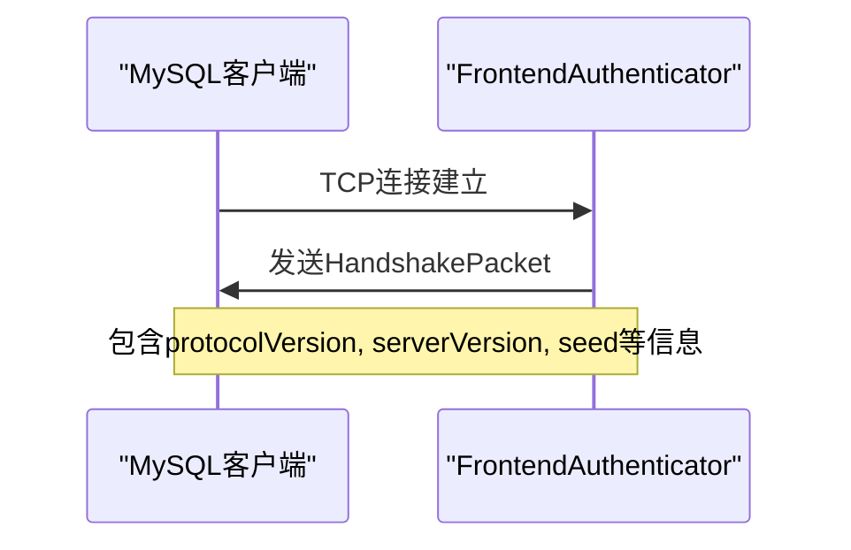
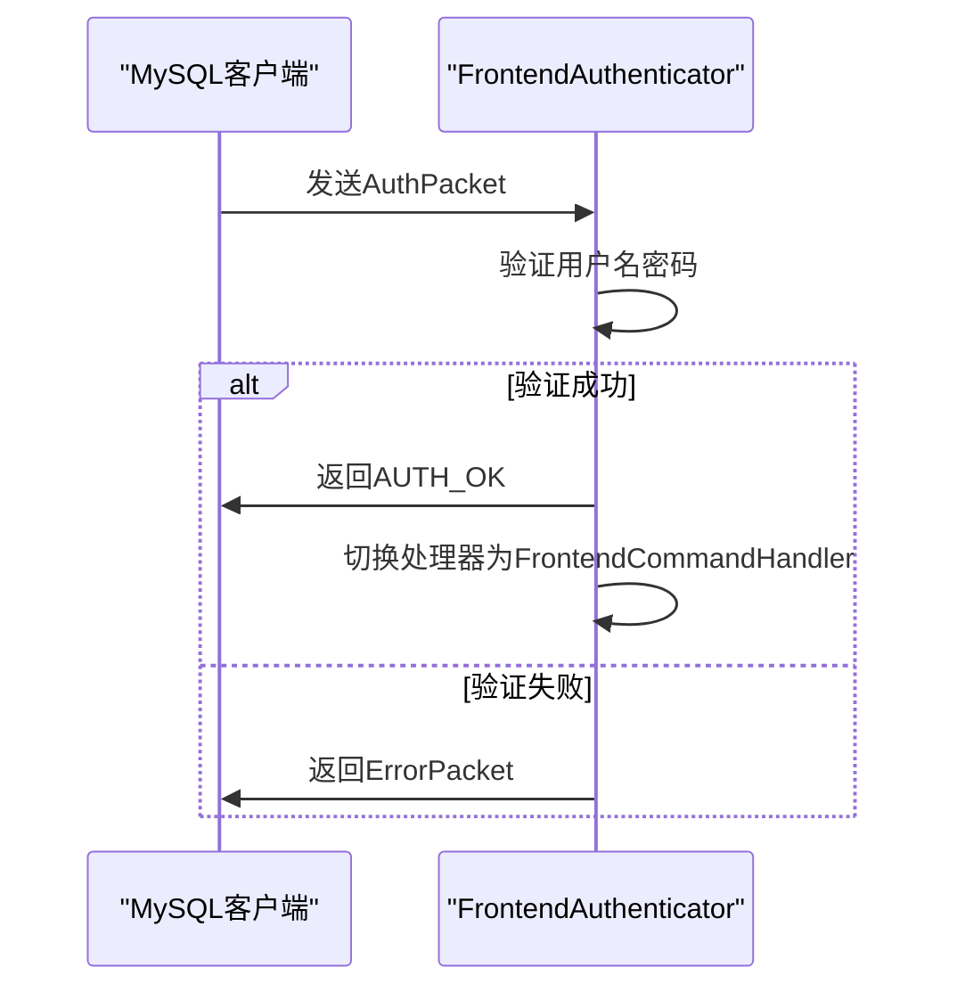
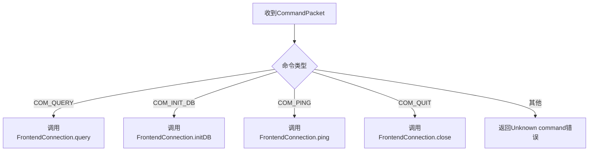
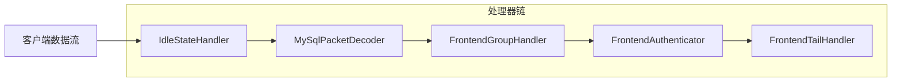
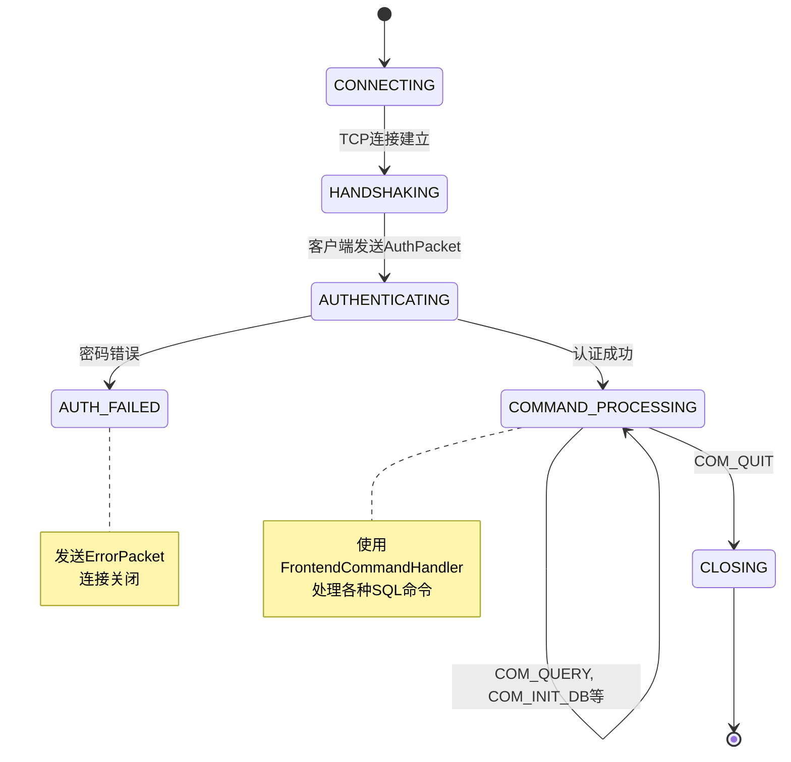
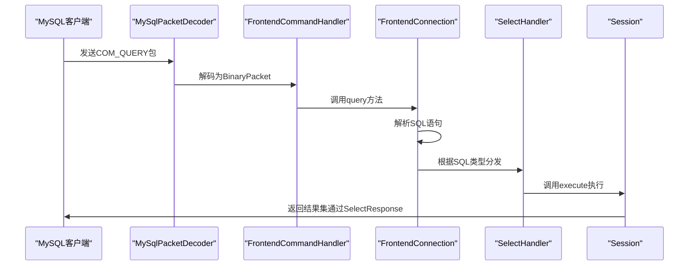

# 网络层

<cite>
**本文档中引用的文件**  
- [HandshakePacket.java](file://src/main/java/alchemystar/freedom/engine/net/proto/mysql/HandshakePacket.java)
- [AuthPacket.java](file://src/main/java/alchemystar/freedom/engine/net/proto/mysql/AuthPacket.java)
- [CommandPacket.java](file://src/main/java/alchemystar/freedom/engine/net/proto/mysql/CommandPacket.java)
- [FrontendConnection.java](file://src/main/java/alchemystar/freedom/engine/net/handler/frontend/FrontendConnection.java)
- [FrontHandlerFactory.java](file://src/main/java/alchemystar/freedom/engine/net/handler/factory/FrontHandlerFactory.java)
- [MySqlPacketDecoder.java](file://src/main/java/alchemystar/freedom/engine/net/codec/MySqlPacketDecoder.java)
- [FrontendAuthenticator.java](file://src/main/java/alchemystar/freedom/engine/net/handler/frontend/FrontendAuthenticator.java)
- [FrontendCommandHandler.java](file://src/main/java/alchemystar/freedom/engine/net/handler/frontend/FrontendCommandHandler.java)
- [ErrorPacket.java](file://src/main/java/alchemystar/freedom/engine/net/proto/mysql/ErrorPacket.java)
- [ErrorPacketException.java](file://src/main/java/alchemystar/freedom/engine/net/exception/ErrorPacketException.java)
- [SelectResponse.java](file://src/main/java/alchemystar/freedom/engine/net/response/SelectResponse.java)
- [SelectHandler.java](file://src/main/java/alchemystar/freedom/engine/net/handler/frontend/SelectHandler.java)
</cite>

## 目录
1. [引言](#引言)
2. [握手流程](#握手流程)
3. [认证机制](#认证机制)
4. [命令分发](#命令分发)
5. [连接管理](#连接管理)
6. [Netty ChannelPipeline 与处理器链](#netty-channelpipeline-与处理器链)
7. [错误处理机制](#错误处理机制)
8. [心跳机制](#心跳机制)
9. [网络层状态机](#网络层状态机)
10. [SELECT查询请求处理流程](#select查询请求处理流程)

## 引言

本项目中的网络层实现了MySQL通信协议的核心部分，基于Netty构建，负责客户端连接的建立、认证、命令解析与响应。网络层通过一系列自定义的MySQL协议包（如握手包、认证包、命令包等）实现与MySQL客户端的兼容通信。整个流程由Netty的ChannelPipeline驱动，通过处理器链完成从连接建立到SQL执行的完整生命周期管理。

**网络层的主要职责包括**：
- 实现MySQL协议的握手与认证
- 解析客户端发送的命令包
- 管理前端连接状态
- 分发不同类型的SQL命令
- 处理异常与错误响应
- 维护连接的心跳与超时

## 握手流程

当客户端发起连接时，服务端首先发送一个`HandshakePacket`，标志着握手流程的开始。

`HandshakePacket`包含以下关键字段：
- `protocolVersion`: 协议版本
- `serverVersion`: 服务器版本信息
- `threadId`: 连接线程ID
- `seed`: 用于密码加密的随机种子
- `serverCapabilities`: 服务器支持的功能标志
- `serverCharsetIndex`: 默认字符集
- `serverStatus`: 服务器状态

该包由`FrontendAuthenticator`在`channelActive`事件中构造并发送，其中`seed`由`RandomUtil`生成，用于后续的密码验证。

**图示来源**
- [HandshakePacket.java](file://src/main/java/alchemystar/freedom/engine/net/proto/mysql/HandshakePacket.java#L1-L77)
- [FrontendAuthenticator.java](file://src/main/java/alchemystar/freedom/engine/net/handler/frontend/FrontendAuthenticator.java#L50-L75)

## 认证机制

客户端收到`HandshakePacket`后，会回复一个`AuthPacket`进行身份验证。

`AuthPacket`包含：
- `clientFlags`: 客户端功能标志
- `maxPacketSize`: 最大包大小
- `charsetIndex`: 请求字符集
- `user`: 用户名
- `password`: 加密后的密码
- `database`: 初始数据库（可选）

认证逻辑在`FrontendAuthenticator.channelRead`中处理：
1. 读取`AuthPacket`
2. 使用`SecurityUtil.scramble411`对数据库配置的密码和`seed`进行加密
3. 比对客户端发送的密码是否匹配
4. 认证成功后，替换Pipeline中的处理器为`FrontendCommandHandler`，并返回`OkPacket.AUTH_OK`

**图示来源**
- [AuthPacket.java](file://src/main/java/alchemystar/freedom/engine/net/proto/mysql/AuthPacket.java#L1-L119)
- [FrontendAuthenticator.java](file://src/main/java/alchemystar/freedom/engine/net/handler/frontend/FrontendAuthenticator.java#L80-L150)

## 命令分发

认证成功后，连接进入命令处理阶段，由`FrontendCommandHandler`负责分发不同类型的`CommandPacket`。

`CommandPacket`包含：
- `command`: 命令类型（如COM_QUERY, COM_INIT_DB等）
- `arg`: 命令参数（如SQL语句）

`FrontendCommandHandler.channelRead`根据`command`类型进行分发：
- `COM_INIT_DB`: 调用`FrontendConnection.initDB`
- `COM_QUERY`: 调用`FrontendConnection.query`
- `COM_PING`: 调用`FrontendConnection.ping`
- `COM_QUIT`: 调用`FrontendConnection.close`
- 其他命令返回“Unknown command”错误

**图示来源**
- [CommandPacket.java](file://src/main/java/alchemystar/freedom/engine/net/proto/mysql/CommandPacket.java#L1-L63)
- [FrontendCommandHandler.java](file://src/main/java/alchemystar/freedom/engine/net/handler/frontend/FrontendCommandHandler.java#L30-L70)

## 连接管理

`FrontendConnection`是前端连接的核心管理类，封装了Netty的`ChannelHandlerContext`，并维护连接的会话状态。

其主要功能包括：
- 存储连接信息（用户、主机、端口、schema、字符集等）
- 管理会话（`Session`）
- 提供SQL执行入口（`execute`方法）
- 处理各种命令（`query`, `initDB`, `ping`等）
- 发送响应（`writeOk`, `writeErrMessage`等）

连接的生命周期由`FrontendConnection`统一管理，从握手、认证到命令处理，再到最终关闭。

**本节来源**
- [FrontendConnection.java](file://src/main/java/alchemystar/freedom/engine/net/handler/frontend/FrontendConnection.java#L1-L320)

## Netty ChannelPipeline 与处理器链

网络层基于Netty的`ChannelPipeline`构建，通过`FrontHandlerFactory`创建处理器链。

处理器链的构建顺序如下：
1. `IdleStateHandler`: 心跳检测
2. `MySqlPacketDecoder`: MySQL协议解码
3. `FrontendGroupHandler`: 连接分组管理（未展开）
4. `FrontendAuthenticator`: 认证处理器
5. `FrontendTailHandler`: 尾部处理器（未展开）

`MySqlPacketDecoder`负责将字节流解码为`BinaryPacket`对象，根据MySQL协议的包头（3字节长度 + 1字节ID）进行分包。

**图示来源**
- [FrontHandlerFactory.java](file://src/main/java/alchemystar/freedom/engine/net/handler/factory/FrontHandlerFactory.java#L1-L41)
- [MySqlPacketDecoder.java](file://src/main/java/alchemystar/freedom/engine/net/codec/MySqlPacketDecoder.java#L1-L63)

## 错误处理机制

网络层通过`ErrorPacket`和`ErrorPacketException`实现错误处理。

`ErrorPacket`是MySQL协议定义的错误响应包，包含：
- `errno`: 错误码
- `sqlState`: SQL状态码
- `message`: 错误消息

`FrontendConnection.writeErrMessage`方法用于发送错误响应。`ErrorPacketException`是运行时异常，用于在代码中抛出和捕获网络层错误。

当发生错误时（如未知命令、空SQL、字符集不支持等），系统会构造`ErrorPacket`并通过`ChannelHandlerContext`发送给客户端。

**本节来源**
- [ErrorPacket.java](file://src/main/java/alchemystar/freedom/engine/net/proto/mysql/ErrorPacket.java#L1-L80)
- [ErrorPacketException.java](file://src/main/java/alchemystar/freedom/engine/net/exception/ErrorPacketException.java#L1-L27)

## 心跳机制

系统通过Netty的`IdleStateHandler`实现心跳检测。

在`FrontHandlerFactory`中配置了`IdleStateHandler`，其参数为：
- 读空闲时间：`SystemConfig.IDLE_CHECK_INTERVAL`
- 写空闲时间：`SystemConfig.IDLE_CHECK_INTERVAL`
- 全空闲时间：`SystemConfig.IDLE_CHECK_INTERVAL`

当连接空闲时间超过`SystemConfig.IDLE_TIME_OUT`时，`FrontendCommandHandler.userEventTriggered`会触发连接关闭。

此外，`COM_PING`和`COM_HEARTBEAT`命令也会被响应，返回`OkPacket`。

**本节来源**
- [FrontHandlerFactory.java](file://src/main/java/alchemystar/freedom/engine/net/handler/factory/FrontHandlerFactory.java#L30)
- [FrontendCommandHandler.java](file://src/main/java/alchemystar/freedom/engine/net/handler/frontend/FrontendCommandHandler.java#L80-L90)

## 网络层状态机

**图示来源**
- [FrontendAuthenticator.java](file://src/main/java/alchemystar/freedom/engine/net/handler/frontend/FrontendAuthenticator.java)
- [FrontendCommandHandler.java](file://src/main/java/alchemystar/freedom/engine/net/handler/frontend/FrontendCommandHandler.java)

## SELECT查询请求处理流程

以一个`SELECT * FROM users`查询为例，说明网络层的处理流程：

具体步骤：
1. 客户端发送`COM_QUERY`命令包
2. `MySqlPacketDecoder`解码为`BinaryPacket`
3. `FrontendCommandHandler`接收到包，调用`FrontendConnection.query`
4. `FrontendConnection.query`解析SQL，调用`session.execute`
5. `SelectHandler`根据SQL内容决定如何响应（如内置命令或转发执行）
6. 最终通过`SelectResponse`构造结果集并返回

**本节来源**
- [FrontendConnection.java](file://src/main/java/alchemystar/freedom/engine/net/handler/frontend/FrontendConnection.java#L100-L130)
- [SelectHandler.java](file://src/main/java/alchemystar/freedom/engine/net/handler/frontend/SelectHandler.java#L1-L40)
- [SelectResponse.java](file://src/main/java/alchemystar/freedom/engine/net/response/SelectResponse.java#L1-L152)