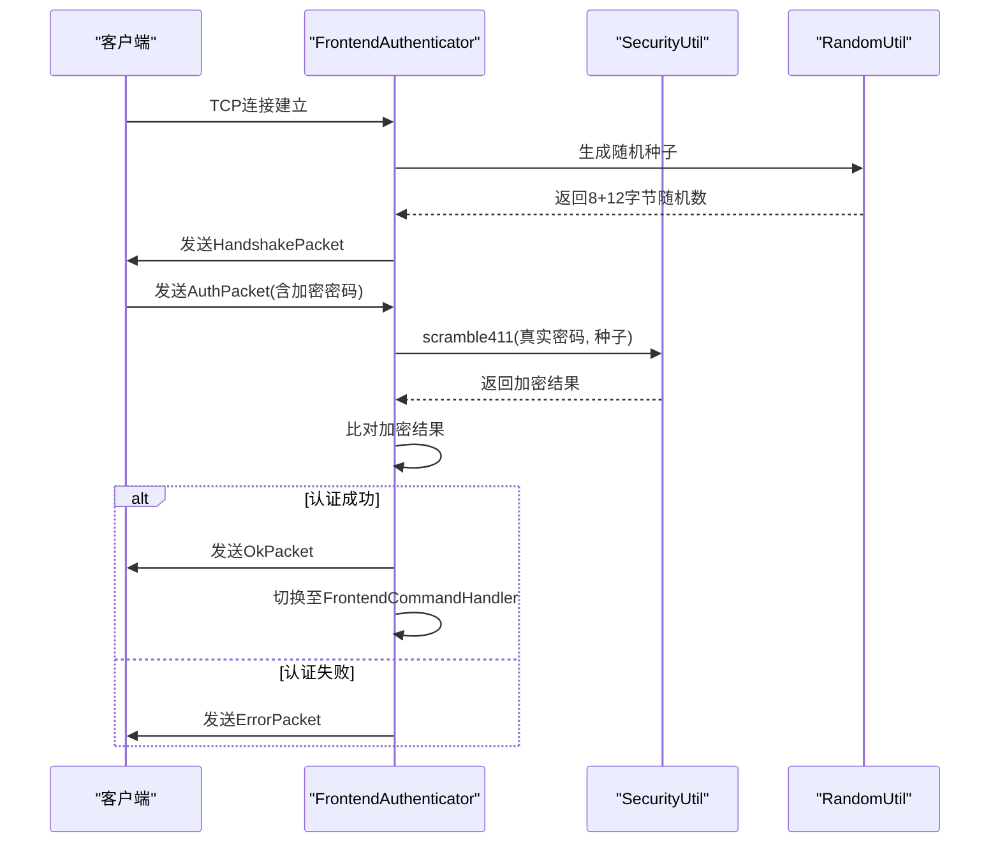
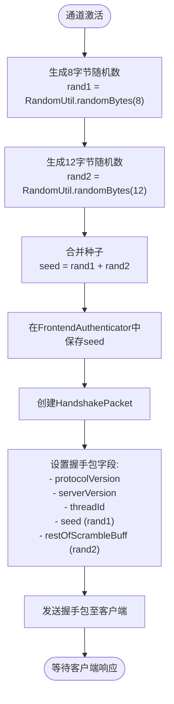
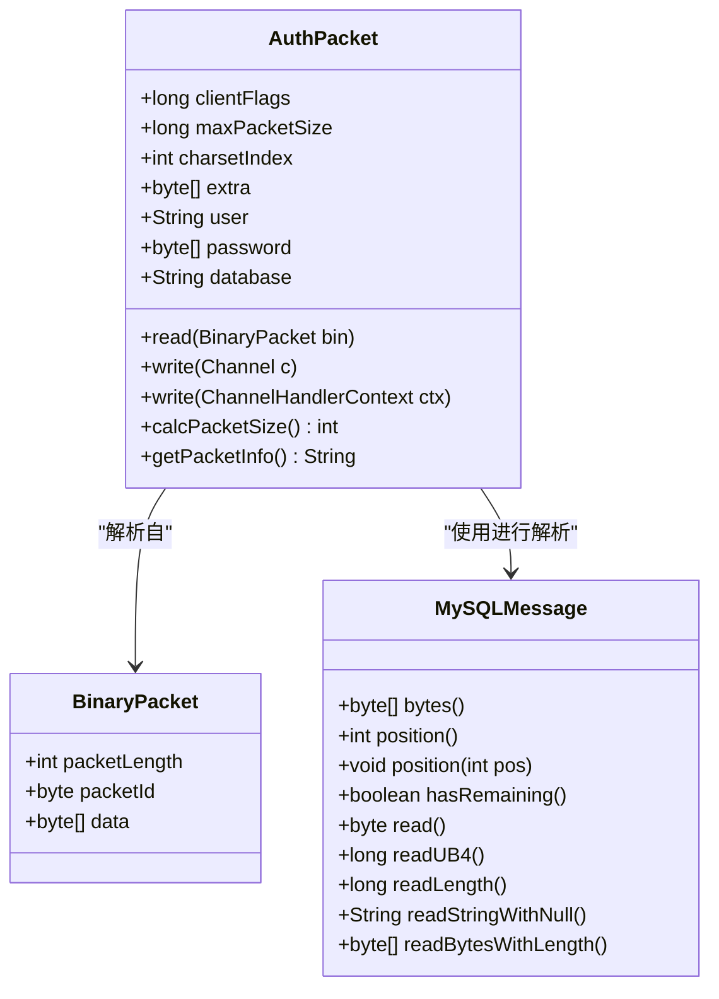
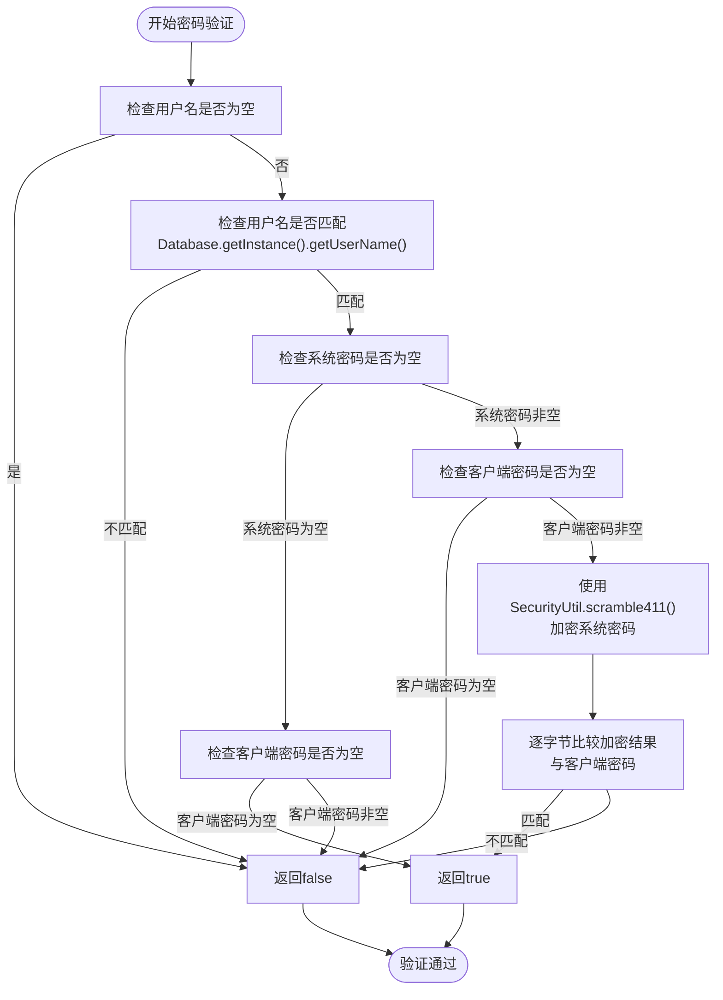
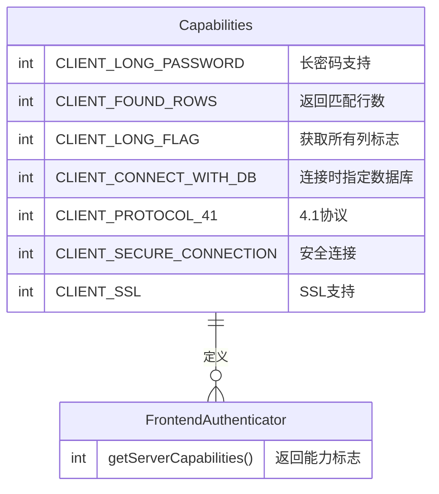
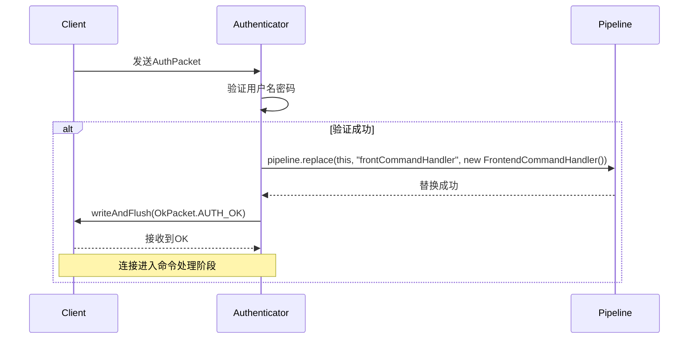
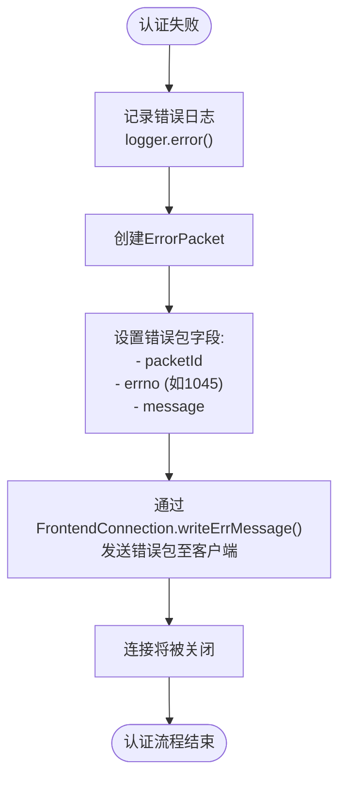
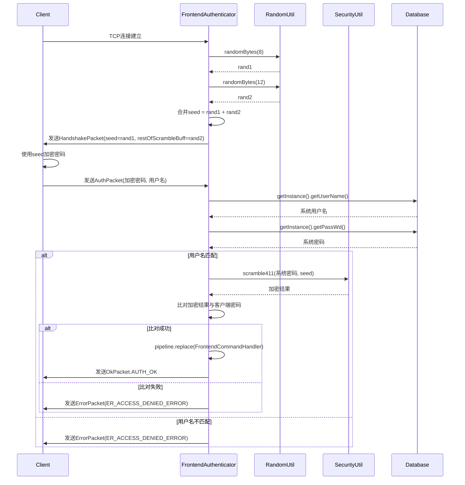

# 认证机制

<cite>
**本文档中引用的文件**   
- [FrontendAuthenticator.java](file://src/main/java/alchemystar/freedom/engine/net/handler/frontend/FrontendAuthenticator.java)
- [AuthPacket.java](file://src/main/java/alchemystar/freedom/engine/net/proto/mysql/AuthPacket.java)
- [HandshakePacket.java](file://src/main/java/alchemystar/freedom/engine/net/proto/mysql/HandshakePacket.java)
- [OkPacket.java](file://src/main/java/alchemystar/freedom/engine/net/proto/mysql/OkPacket.java)
- [ErrorPacketException.java](file://src/main/java/alchemystar/freedom/engine/net/exception/ErrorPacketException.java)
- [RandomUtil.java](file://src/main/java/alchemystar/freedom/engine/net/proto/util/RandomUtil.java)
- [SecurityUtil.java](file://src/main/java/alchemystar/freedom/engine/net/proto/util/SecurityUtil.java)
- [ErrorCode.java](file://src/main/java/alchemystar/freedom/engine/net/proto/util/ErrorCode.java)
- [Capabilities.java](file://src/main/java/alchemystar/freedom/engine/net/proto/util/Capabilities.java)
- [FrontendConnection.java](file://src/main/java/alchemystar/freedom/engine/net/handler/frontend/FrontendConnection.java)
- [Database.java](file://src/main/java/alchemystar/freedom/engine/Database.java)
</cite>

## 目录
1. [简介](#简介)
2. [认证流程概述](#认证流程概述)
3. [握手包发送与随机种子生成](#握手包发送与随机种子生成)
4. [客户端认证请求处理](#客户端认证请求处理)
5. [密码验证机制](#密码验证机制)
6. [能力标志检查](#能力标志检查)
7. [认证成功响应](#认证成功响应)
8. [认证失败处理](#认证失败处理)
9. [安全风险与改进方向](#安全风险与改进方向)
10. [完整交互流程](#完整交互流程)

## 简介
本文件详细说明了Freedom数据库系统中基于MySQL协议的挑战-响应认证机制。文档重点分析了`FrontendAuthenticator`处理器在通道激活时触发的完整认证流程，包括握手包的生成与发送、客户端认证数据的接收与验证、以及认证结果的响应机制。系统通过`RandomUtil`生成安全的随机种子，并使用`SecurityUtil`提供的SHA1算法进行密码加密匹配，确保了认证过程的安全性。

## 认证流程概述
Freedom系统的认证流程遵循MySQL协议的挑战-响应模式，确保密码不会以明文形式在网络中传输。整个流程始于客户端与服务器建立TCP连接，随后服务器通过`FrontendAuthenticator`处理器发送包含随机挑战的握手包。客户端使用该挑战对密码进行加密后回传，服务器进行验证并返回相应的结果包。

**图示来源**
- [FrontendAuthenticator.java](file://src/main/java/alchemystar/freedom/engine/net/handler/frontend/FrontendAuthenticator.java#L15-L173)
- [RandomUtil.java](file://src/main/java/alchemystar/freedom/engine/net/proto/util/RandomUtil.java#L0-L50)
- [SecurityUtil.java](file://src/main/java/alchemystar/freedom/engine/net/proto/util/SecurityUtil.java#L0-L78)

**本节来源**
- [FrontendAuthenticator.java](file://src/main/java/alchemystar/freedom/engine/net/handler/frontend/FrontendAuthenticator.java#L15-L173)

## 握手包发送与随机种子生成
当客户端通道激活时，`FrontendAuthenticator`的`channelActive`方法被触发，负责生成并发送握手包（HandshakePacket）。该过程的核心是生成一个安全的随机种子（seed），用于后续的挑战-响应认证。

随机种子的生成策略由`RandomUtil`类实现。系统生成两个随机字节数组：一个8字节的`rand1`和一个12字节的`rand2`，然后将它们合并成一个20字节的完整种子。这个种子随后被拆分使用：`rand1`作为握手包中的`seed`字段，`rand2`作为`restOfScrambleBuff`字段。

**图示来源**
- [FrontendAuthenticator.java](file://src/main/java/alchemystar/freedom/engine/net/handler/frontend/FrontendAuthenticator.java#L40-L65)
- [HandshakePacket.java](file://src/main/java/alchemystar/freedom/engine/net/proto/mysql/HandshakePacket.java#L0-L77)
- [RandomUtil.java](file://src/main/java/alchemystar/freedom/engine/net/proto/util/RandomUtil.java#L0-L50)

**本节来源**
- [FrontendAuthenticator.java](file://src/main/java/alchemystar/freedom/engine/net/handler/frontend/FrontendAuthenticator.java#L40-L65)

## 客户端认证请求处理
客户端接收到握手包后，会使用其中的随机种子和自身的用户名、密码生成一个加密的认证包（AuthPacket），并通过`channelRead`方法发送回服务器。`FrontendAuthenticator`的`channelRead`方法负责接收并解析这个认证包。

`AuthPacket`的结构包含了客户端的关键信息：
- `clientFlags`: 客户端能力标志，用于协商功能
- `maxPacketSize`: 客户端支持的最大数据包大小
- `charsetIndex`: 客户端使用的字符集索引
- `user`: 用户名
- `password`: 经过加密的密码
- `database`: 可选的初始数据库

**图示来源**
- [AuthPacket.java](file://src/main/java/alchemystar/freedom/engine/net/proto/mysql/AuthPacket.java#L0-L119)
- [BinaryPacket.java](file://src/main/java/alchemystar/freedom/engine/net/proto/mysql/BinaryPacket.java)
- [MySQLMessage.java](file://src/main/java/alchemystar/freedom/engine/net/proto/mysql/MySQLMessage.java)

**本节来源**
- [FrontendAuthenticator.java](file://src/main/java/alchemystar/freedom/engine/net/handler/frontend/FrontendAuthenticator.java#L67-L75)
- [AuthPacket.java](file://src/main/java/alchemystar/freedom/engine/net/proto/mysql/AuthPacket.java#L0-L119)

## 密码验证机制
密码验证是认证流程的核心安全环节。系统不存储或比较明文密码，而是采用MySQL的`scramble411`算法进行加密匹配。该算法基于SHA1哈希函数，结合服务器生成的随机种子，确保了即使网络被监听，攻击者也无法轻易还原出原始密码。

验证过程如下：
1. 从`Database`单例中获取系统配置的真实用户名和密码。
2. 检查客户端提供的用户名是否与系统用户名匹配。
3. 如果用户名匹配，则使用`SecurityUtil.scramble411`方法，将系统真实密码和之前生成的20字节种子进行加密运算，得到期望的加密结果。
4. 将计算出的加密结果与客户端发来的`password`字段进行逐字节比较。

**图示来源**
- [FrontendAuthenticator.java](file://src/main/java/alchemystar/freedom/engine/net/handler/frontend/FrontendAuthenticator.java#L100-L145)
- [SecurityUtil.java](file://src/main/java/alchemystar/freedom/engine/net/proto/util/SecurityUtil.java#L0-L78)
- [Database.java](file://src/main/java/alchemystar/freedom/engine/Database.java)

**本节来源**
- [FrontendAuthenticator.java](file://src/main/java/alchemystar/freedom/engine/net/handler/frontend/FrontendAuthenticator.java#L100-L145)

## 能力标志检查
在`getServerCapabilities`方法中，服务器定义了其支持的功能集。这些能力通过位标志（bit flags）进行编码，客户端在`AuthPacket`中也会发送其支持的能力。服务器通过这些标志来协商连接的特性。

当前实现中，服务器启用了以下关键能力：
- `CLIENT_LONG_PASSWORD`: 支持长密码
- `CLIENT_PROTOCOL_41`: 使用MySQL 4.1及以上协议
- `CLIENT_SECURE_CONNECTION`: 支持安全连接（加密密码）
- `CLIENT_CONNECT_WITH_DB`: 允许在连接时指定数据库
- `CLIENT_TRANSACTIONS`: 支持事务

值得注意的是，`CLIENT_SSL`标志被注释掉了，表明当前实现不支持SSL加密连接。

**图示来源**
- [FrontendAuthenticator.java](file://src/main/java/alchemystar/freedom/engine/net/handler/frontend/FrontendAuthenticator.java#L85-L100)
- [Capabilities.java](file://src/main/java/alchemystar/freedom/engine/net/proto/util/Capabilities.java#L0-L85)

**本节来源**
- [FrontendAuthenticator.java](file://src/main/java/alchemystar/freedom/engine/net/handler/frontend/FrontendAuthenticator.java#L85-L100)

## 认证成功响应
当用户名和密码验证通过后，系统会执行`success`方法，完成认证流程的最后一步。此过程包含两个关键操作：

1. **处理器切换**：通过Netty的pipeline机制，将当前的`FrontendAuthenticator`处理器替换为`FrontendCommandHandler`。这标志着连接状态从“认证中”转变为“已认证，可执行命令”。
2. **发送OkPacket**：向客户端写入一个预定义的`OkPacket.AUTH_OK`字节数组。这是一个固定格式的成功响应包，通知客户端认证已成功，可以开始发送SQL命令。

**图示来源**
- [FrontendAuthenticator.java](file://src/main/java/alchemystar/freedom/engine/net/handler/frontend/FrontendAuthenticator.java#L80-L83)
- [OkPacket.java](file://src/main/java/alchemystar/freedom/engine/net/proto/mysql/OkPacket.java#L0-L70)
- [FrontendCommandHandler.java](file://src/main/java/alchemystar/freedom/engine/net/handler/frontend/FrontendCommandHandler.java)

**本节来源**
- [FrontendAuthenticator.java](file://src/main/java/alchemystar/freedom/engine/net/handler/frontend/FrontendAuthenticator.java#L80-L83)

## 认证失败处理
如果认证过程中的任何一步失败（如用户名不匹配、密码错误），系统会调用`failure`方法来处理错误。该方法会记录错误日志，并通过`FrontendConnection`的`writeErrMessage`方法向客户端发送一个错误包（ErrorPacket）。

错误包中包含：
- `errno`: 错误码，来自`ErrorCode`接口。例如，`ER_ACCESS_DENIED_ERROR` (1045) 表示访问被拒绝。
- `info`: 错误信息，通常包含更详细的描述，如"Access denied for user 'xxx'"。

**图示来源**
- [FrontendAuthenticator.java](file://src/main/java/alchemystar/freedom/engine/net/handler/frontend/FrontendAuthenticator.java#L147-L152)
- [FrontendConnection.java](file://src/main/java/alchemystar/freedom/engine/net/handler/frontend/FrontendConnection.java#L180-L194)
- [ErrorCode.java](file://src/main/java/alchemystar/freedom/engine/net/proto/util/ErrorCode.java#L0-L522)

**本节来源**
- [FrontendAuthenticator.java](file://src/main/java/alchemystar/freedom/engine/net/handler/frontend/FrontendAuthenticator.java#L147-L152)

## 安全风险与改进方向
尽管当前的挑战-响应机制避免了明文密码传输，但仍存在一些潜在的安全风险和改进空间。

**当前安全风险**：
1. **缺乏传输层加密**：整个认证过程（包括握手包和认证包）均以明文在网络中传输。虽然密码是加密的，但用户名、数据库名、字符集等信息是明文的，可能被中间人攻击者利用。
2. **随机数生成器安全性**：`RandomUtil`使用了一个自定义的线性同余生成器（LCG），其密码学安全性不如`java.security.SecureRandom`。
3. **硬编码凭证**：用户名和密码直接从`Database`单例获取，缺乏灵活的用户管理和凭证存储机制。

**未来改进方向**：
1. **实现SSL/TLS支持**：启用`CLIENT_SSL`能力标志，实现传输层加密，保护所有通信数据。
2. **使用安全的随机数生成器**：将`RandomUtil`替换为`SecureRandom`，提高挑战种子的不可预测性。
3. **引入用户管理系统**：将用户凭证存储在安全的数据库中，并支持多用户、角色和权限管理。
4. **支持更强的加密算法**：考虑支持更现代的加密算法，如基于SHA256的认证。

## 完整交互流程
以下是挑战-响应认证机制的完整交互流程，结合了上述所有组件：

**图示来源**
- [FrontendAuthenticator.java](file://src/main/java/alchemystar/freedom/engine/net/handler/frontend/FrontendAuthenticator.java#L15-L173)
- [RandomUtil.java](file://src/main/java/alchemystar/freedom/engine/net/proto/util/RandomUtil.java#L0-L50)
- [SecurityUtil.java](file://src/main/java/alchemystar/freedom/engine/net/proto/util/SecurityUtil.java#L0-L78)
- [Database.java](file://src/main/java/alchemystar/freedom/engine/Database.java)
- [OkPacket.java](file://src/main/java/alchemystar/freedom/engine/net/proto/mysql/OkPacket.java#L0-L70)
- [ErrorCode.java](file://src/main/java/alchemystar/freedom/engine/net/proto/util/ErrorCode.java#L0-L522)

**本节来源**
- [FrontendAuthenticator.java](file://src/main/java/alchemystar/freedom/engine/net/handler/frontend/FrontendAuthenticator.java#L15-L173)