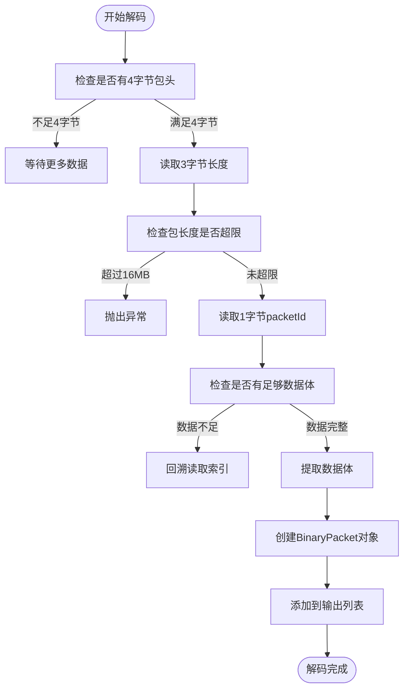
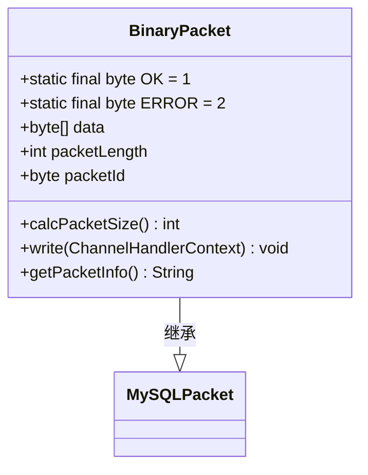
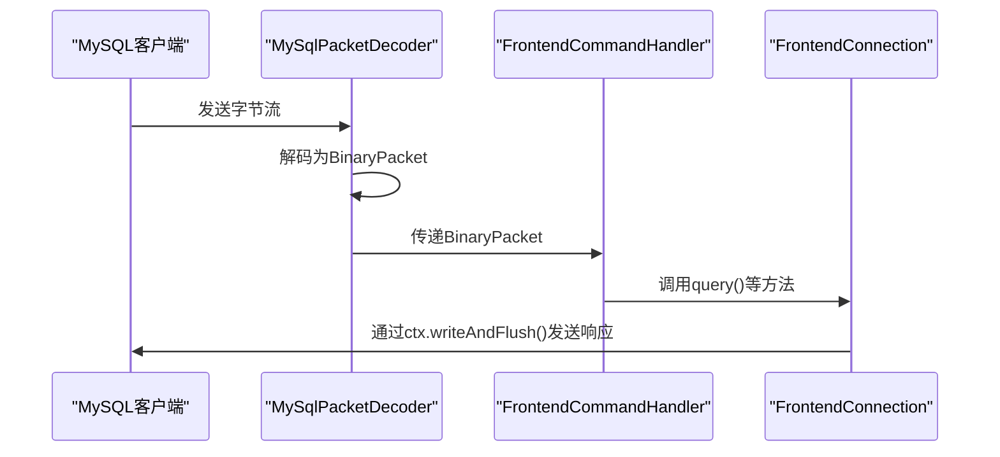
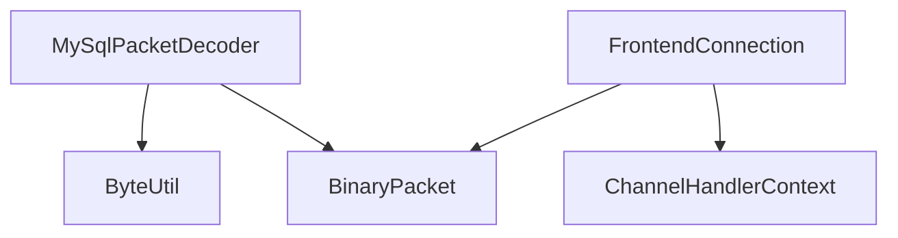

# 协议解码器

<cite>
**本文档引用的文件**  
- [MySqlPacketDecoder.java](file://src/main/java/alchemystar/freedom/engine/net/codec/MySqlPacketDecoder.java)
- [BinaryPacket.java](file://src/main/java/alchemystar/freedom/engine/net/proto/mysql/BinaryPacket.java)
- [ByteUtil.java](file://src/main/java/alchemystar/freedom/engine/net/proto/util/ByteUtil.java)
- [FrontendConnection.java](file://src/main/java/alchemystar/freedom/engine/net/handler/frontend/FrontendConnection.java)
</cite>

## 目录
1. [简介](#简介)
2. [项目结构](#项目结构)
3. [核心组件](#核心组件)
4. [架构概述](#架构概述)
5. [详细组件分析](#详细组件分析)
6. [依赖分析](#依赖分析)
7. [性能考虑](#性能考虑)
8. [故障排查指南](#故障排查指南)
9. [结论](#结论)

## 简介
本文档详细解析了基于Netty实现的MySQL协议解码器`MySqlPacketDecoder`，重点阐述其在Netty Pipeline中的职责。文档深入分析了该解码器如何依据MySQL协议规范，正确解析3字节长度字段和1字节sequenceId，实现TCP粘包与拆包的分帧处理。同时，结合源码说明`decode`方法的实现逻辑，包括缓冲区管理、包头读取、完整报文判断及消息传递机制，并描述其与`FrontendConnection`的协作关系，确保解码后的数据包能正确路由至对应的连接处理器。

## 项目结构
项目采用典型的Java分层架构，核心网络处理模块位于`engine/net`目录下，包含编解码、处理器、协议定义等子模块。协议解码器位于`codec`包中，前端连接处理逻辑位于`handler/frontend`包中，MySQL协议相关数据结构定义于`proto/mysql`包中。

```mermaid
graph TD
subgraph "核心模块"
Codec[codec]
Handler[handler]
Proto[proto]
end
Codec --> Proto : 依赖
Handler --> Proto : 依赖
Handler --> Codec : 使用解码器
```

**Diagram sources**
- [MySqlPacketDecoder.java](file://src/main/java/alchemystar/freedom/engine/net/codec/MySqlPacketDecoder.java#L1-L63)
- [FrontendConnection.java](file://src/main/java/alchemystar/freedom/engine/net/handler/frontend/FrontendConnection.java#L1-L321)

**Section sources**
- [MySqlPacketDecoder.java](file://src/main/java/alchemystar/freedom/engine/net/codec/MySqlPacketDecoder.java#L1-L63)
- [FrontendConnection.java](file://src/main/java/alchemystar/freedom/engine/net/handler/frontend/FrontendConnection.java#L1-L321)

## 核心组件
`MySqlPacketDecoder`是Netty Pipeline中的关键组件，负责将原始字节流按照MySQL协议规范解码为结构化的`BinaryPacket`对象。它继承自`ByteToMessageDecoder`，利用Netty的缓冲区管理机制，高效处理TCP流中的粘包与拆包问题。

**Section sources**
- [MySqlPacketDecoder.java](file://src/main/java/alchemystar/freedom/engine/net/codec/MySqlPacketDecoder.java#L1-L63)

## 架构概述
系统采用Netty作为网络通信框架，`MySqlPacketDecoder`位于Pipeline的前端，负责将接收到的字节流解码为`BinaryPacket`，随后由`FrontendCommandHandler`等处理器进行业务逻辑处理。`FrontendConnection`封装了客户端连接的状态信息，并作为上下文在各处理器间传递。


**Diagram sources**
- [MySqlPacketDecoder.java](file://src/main/java/alchemystar/freedom/engine/net/codec/MySqlPacketDecoder.java#L1-L63)
- [FrontendConnection.java](file://src/main/java/alchemystar/freedom/engine/net/handler/frontend/FrontendConnection.java#L1-L321)

## 详细组件分析

### MySqlPacketDecoder 分析
`MySqlPacketDecoder`实现了MySQL协议的分帧逻辑，其核心在于`decode`方法。

#### 解码流程分析


**Diagram sources**
- [MySqlPacketDecoder.java](file://src/main/java/alchemystar/freedom/engine/net/codec/MySqlPacketDecoder.java#L18-L62)

#### 核心字段与方法
- **packetHeaderSize**: 固定为4，表示MySQL包头长度（3字节长度 + 1字节sequenceId）
- **maxPacketSize**: 最大包大小限制为16MB，防止内存溢出攻击
- **decode方法**: 实现了完整的分帧逻辑，包括半包处理和过载保护

**Section sources**
- [MySqlPacketDecoder.java](file://src/main/java/alchemystar/freedom/engine/net/codec/MySqlPacketDecoder.java#L18-L62)

### BinaryPacket 分析
`BinaryPacket`是MySQL协议外层结构的Java表示，封装了包长度、sequenceId和数据体。



**Diagram sources**
- [BinaryPacket.java](file://src/main/java/alchemystar/freedom/engine/net/proto/mysql/BinaryPacket.java#L1-L43)

**Section sources**
- [BinaryPacket.java](file://src/main/java/alchemystar/freedom/engine/net/proto/mysql/BinaryPacket.java#L1-L43)

### FrontendConnection 分析
`FrontendConnection`代表一个前端客户端连接，持有Netty的`ChannelHandlerContext`，用于向客户端发送响应。

#### 与解码器的协作


**Diagram sources**
- [MySqlPacketDecoder.java](file://src/main/java/alchemystar/freedom/engine/net/codec/MySqlPacketDecoder.java#L18-L62)
- [FrontendConnection.java](file://src/main/java/alchemystar/freedom/engine/net/handler/frontend/FrontendConnection.java#L25-L319)

**Section sources**
- [FrontendConnection.java](file://src/main/java/alchemystar/freedom/engine/net/handler/frontend/FrontendConnection.java#L25-L319)

## 依赖分析
`MySqlPacketDecoder`依赖于`ByteUtil`工具类进行无符号整数的读取，依赖`BinaryPacket`作为输出消息类型。`FrontendConnection`依赖`BinaryPacket`来接收解码后的消息，并通过`ChannelHandlerContext`与Netty框架交互。



**Diagram sources**
- [MySqlPacketDecoder.java](file://src/main/java/alchemystar/freedom/engine/net/codec/MySqlPacketDecoder.java#L1-L63)
- [ByteUtil.java](file://src/main/java/alchemystar/freedom/engine/net/proto/util/ByteUtil.java#L1-L91)
- [BinaryPacket.java](file://src/main/java/alchemystar/freedom/engine/net/proto/mysql/BinaryPacket.java#L1-L43)
- [FrontendConnection.java](file://src/main/java/alchemystar/freedom/engine/net/handler/frontend/FrontendConnection.java#L1-L321)

**Section sources**
- [MySqlPacketDecoder.java](file://src/main/java/alchemystar/freedom/engine/net/codec/MySqlPacketDecoder.java#L1-L63)
- [ByteUtil.java](file://src/main/java/alchemystar/freedom/engine/net/proto/util/ByteUtil.java#L1-L91)

## 性能考虑
- **缓冲区管理**: 利用Netty的`ByteBuf`和`markReaderIndex`/`resetReaderIndex`机制，避免不必要的内存复制
- **过载保护**: 设置16MB的最大包大小限制，防止恶意客户端导致内存耗尽
- **零拷贝**: `packet.data = in.readBytes(packetLength).array()`直接获取底层字节数组，减少内存拷贝
- **异常处理**: 对不完整包进行回溯处理，避免数据丢失

## 故障排查指南
- **半包问题**: 如果客户端频繁发送小数据包，可能导致`in.readableBytes() < packetHeaderSize`或`in.readableBytes() < packetLength`，这是正常现象，Netty会累积数据直到完整包到达
- **超大包异常**: 当收到超过16MB的包时，会抛出`IllegalArgumentException`，需检查客户端是否发送了异常大的查询
- **空数据包**: 如果`packet.data`为空或长度为0，会在日志中记录错误，可能表示协议解析错误
- **字符编码问题**: 在`FrontendConnection.query()`中处理字符串时可能抛出`UnsupportedEncodingException`，需确保客户端和服务器使用兼容的字符集

**Section sources**
- [MySqlPacketDecoder.java](file://src/main/java/alchemystar/freedom/engine/net/codec/MySqlPacketDecoder.java#L18-L62)
- [FrontendConnection.java](file://src/main/java/alchemystar/freedom/engine/net/handler/frontend/FrontendConnection.java#L25-L319)

## 结论
`MySqlPacketDecoder`是一个高效、安全的MySQL协议解码器，它正确实现了MySQL协议的分帧规范，能够处理TCP粘包与拆包问题。通过与`FrontendConnection`的紧密协作，确保了每个解码后的数据包都能正确路由到对应的连接处理器。其设计考虑了性能优化和安全防护，是整个数据库代理系统网络层的核心组件。