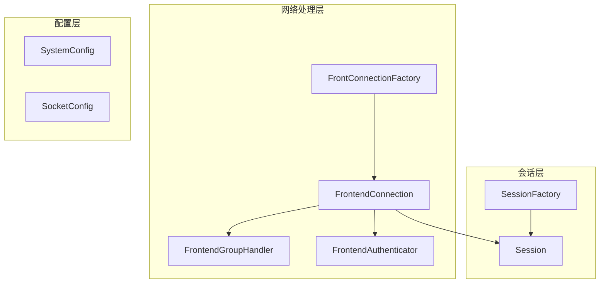
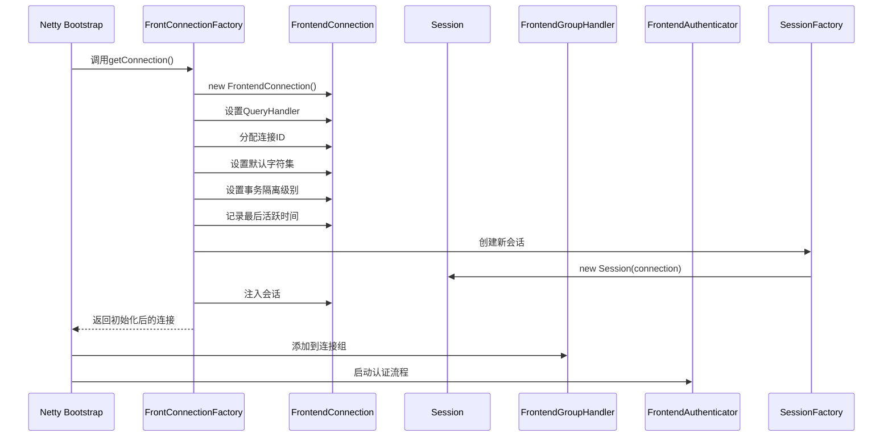
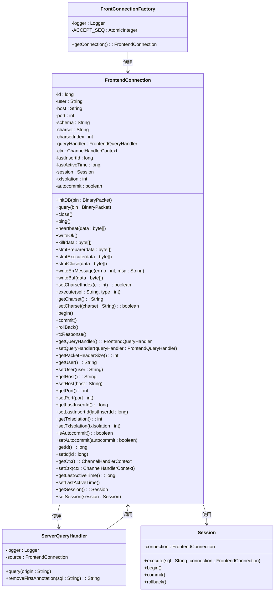
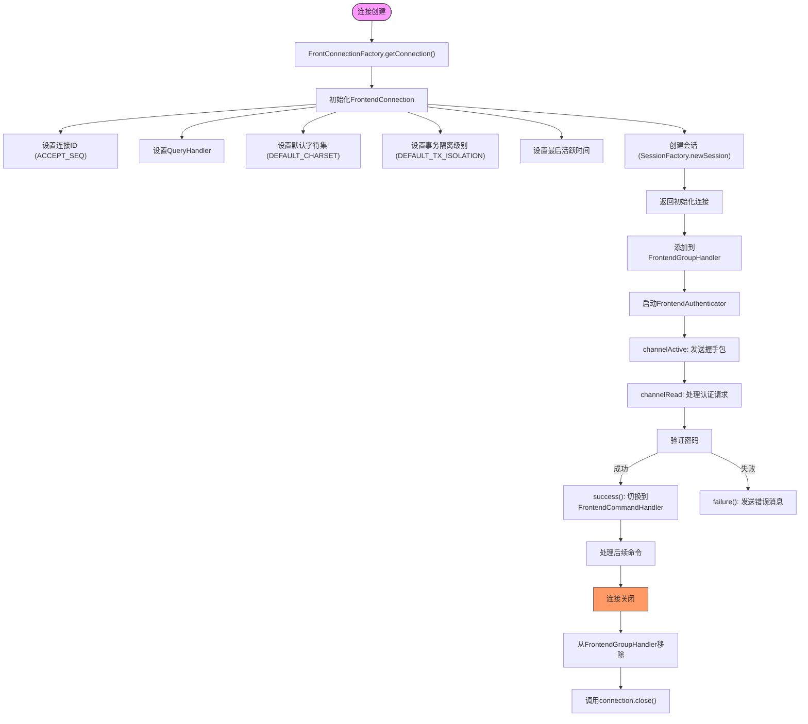
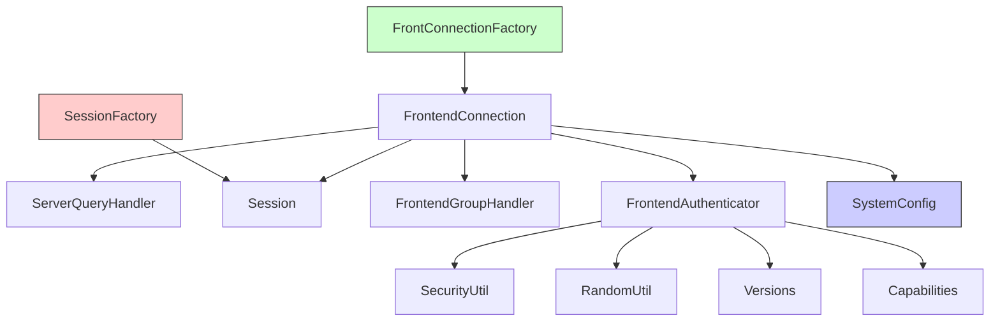

# 连接工厂

<cite>
**本文档中引用的文件**  
- [FrontConnectionFactory.java](file://src/main/java/alchemystar/freedom/engine/net/handler/factory/FrontConnectionFactory.java)
- [FrontendConnection.java](file://src/main/java/alchemystar/freedom/engine/net/handler/frontend/FrontendConnection.java)
- [SystemConfig.java](file://src/main/java/alchemystar/freedom/config/SystemConfig.java)
- [SessionFactory.java](file://src/main/java/alchemystar/freedom/engine/session/SessionFactory.java)
- [ServerQueryHandler.java](file://src/main/java/alchemystar/freedom/engine/net/handler/frontend/ServerQueryHandler.java)
- [FrontendGroupHandler.java](file://src/main/java/alchemystar/freedom/engine/net/handler/frontend/FrontendGroupHandler.java)
- [FrontendAuthenticator.java](file://src/main/java/alchemystar/freedom/engine/net/handler/frontend/FrontendAuthenticator.java)
</cite>

## 目录
1. [引言](#引言)
2. [项目结构](#项目结构)
3. [核心组件](#核心组件)
4. [架构概述](#架构概述)
5. [详细组件分析](#详细组件分析)
6. [依赖分析](#依赖分析)
7. [性能考虑](#性能考虑)
8. [故障排除指南](#故障排除指南)
9. [结论](#结论)

## 引言
本文档详细描述了`FrontConnectionFactory`类如何通过工厂模式创建和初始化`FrontendConnection`实例。重点阐述其在连接生命周期管理中的作用，包括连接的创建、配置初始化（如设置ChannelPipeline、绑定处理器）和资源注入（如会话、上下文）。结合代码示例展示工厂如何与Netty的Bootstrap结合使用，实现高并发下的连接快速构建与回收。解释连接ID生成策略、连接超时设置以及异常处理机制。阐述其与连接池设计的潜在扩展关系，并提供性能调优建议，如对象复用、线程安全控制和内存泄漏防范。

## 项目结构
本项目采用典型的Java分层架构，主要模块包括网络处理、会话管理、配置管理等。连接工厂模块位于`engine/net/handler/factory`包中，负责前端连接的创建与初始化。

**Diagram sources**
- [FrontConnectionFactory.java](file://src/main/java/alchemystar/freedom/engine/net/handler/factory/FrontConnectionFactory.java#L1-L38)
- [FrontendConnection.java](file://src/main/java/alchemystar/freedom/engine/net/handler/frontend/FrontendConnection.java#L1-L321)
- [SessionFactory.java](file://src/main/java/alchemystar/freedom/engine/session/SessionFactory.java#L1-L14)

**Section sources**
- [FrontConnectionFactory.java](file://src/main/java/alchemystar/freedom/engine/net/handler/factory/FrontConnectionFactory.java#L1-L38)
- [FrontendConnection.java](file://src/main/java/alchemystar/freedom/engine/net/handler/frontend/FrontendConnection.java#L1-L321)

## 核心组件
`FrontConnectionFactory`是前端连接的工厂类，负责创建并初始化`FrontendConnection`实例。它通过工厂模式封装了连接创建的复杂性，确保每次创建的连接都具有一致的初始状态。

**Section sources**
- [FrontConnectionFactory.java](file://src/main/java/alchemystar/freedom/engine/net/handler/factory/FrontConnectionFactory.java#L1-L38)
- [FrontendConnection.java](file://src/main/java/alchemystar/freedom/engine/net/handler/frontend/FrontendConnection.java#L1-L321)

## 架构概述
连接工厂模块在整个系统中扮演着关键角色，负责前端连接的创建、初始化和生命周期管理。它与Netty框架紧密结合，利用其事件驱动模型实现高效的连接处理。

**Diagram sources**
- [FrontConnectionFactory.java](file://src/main/java/alchemystar/freedom/engine/net/handler/factory/FrontConnectionFactory.java#L1-L38)
- [FrontendConnection.java](file://src/main/java/alchemystar/freedom/engine/net/handler/frontend/FrontendConnection.java#L1-L321)
- [FrontendGroupHandler.java](file://src/main/java/alchemystar/freedom/engine/net/handler/frontend/FrontendGroupHandler.java#L1-L42)
- [FrontendAuthenticator.java](file://src/main/java/alchemystar/freedom/engine/net/handler/frontend/FrontendAuthenticator.java#L1-L173)

## 详细组件分析

### FrontConnectionFactory 分析
`FrontConnectionFactory`类实现了连接的创建和初始化逻辑，是整个连接管理的核心。

#### 类图

**Diagram sources**
- [FrontConnectionFactory.java](file://src/main/java/alchemystar/freedom/engine/net/handler/factory/FrontConnectionFactory.java#L1-L38)
- [FrontendConnection.java](file://src/main/java/alchemystar/freedom/engine/net/handler/frontend/FrontendConnection.java#L1-L321)
- [ServerQueryHandler.java](file://src/main/java/alchemystar/freedom/engine/net/handler/frontend/ServerQueryHandler.java#L1-L85)
- [SessionFactory.java](file://src/main/java/alchemystar/freedom/engine/session/SessionFactory.java#L1-L14)

**Section sources**
- [FrontConnectionFactory.java](file://src/main/java/alchemystar/freedom/engine/net/handler/factory/FrontConnectionFactory.java#L1-L38)
- [FrontendConnection.java](file://src/main/java/alchemystar/freedom/engine/net/handler/frontend/FrontendConnection.java#L1-L321)

### 连接生命周期管理
连接工厂不仅负责创建连接，还参与连接的整个生命周期管理，包括初始化、认证、命令处理和资源回收。

**Diagram sources**
- [FrontConnectionFactory.java](file://src/main/java/alchemystar/freedom/engine/net/handler/factory/FrontConnectionFactory.java#L1-L38)
- [FrontendConnection.java](file://src/main/java/alchemystar/freedom/engine/net/handler/frontend/FrontendConnection.java#L1-L321)
- [FrontendGroupHandler.java](file://src/main/java/alchemystar/freedom/engine/net/handler/frontend/FrontendGroupHandler.java#L1-L42)
- [FrontendAuthenticator.java](file://src/main/java/alchemystar/freedom/engine/net/handler/frontend/FrontendAuthenticator.java#L1-L173)

## 依赖分析
连接工厂模块与其他多个模块存在紧密依赖关系，形成了完整的连接处理链路。

**Diagram sources**
- [FrontConnectionFactory.java](file://src/main/java/alchemystar/freedom/engine/net/handler/factory/FrontConnectionFactory.java#L1-L38)
- [FrontendConnection.java](file://src/main/java/alchemystar/freedom/engine/net/handler/frontend/FrontendConnection.java#L1-L321)
- [SystemConfig.java](file://src/main/java/alchemystar/freedom/config/SystemConfig.java#L1-L38)
- [SessionFactory.java](file://src/main/java/alchemystar/freedom/engine/session/SessionFactory.java#L1-L14)

**Section sources**
- [FrontConnectionFactory.java](file://src/main/java/alchemystar/freedom/engine/net/handler/factory/FrontConnectionFactory.java#L1-L38)
- [FrontendConnection.java](file://src/main/java/alchemystar/freedom/engine/net/handler/frontend/FrontendConnection.java#L1-L321)
- [SystemConfig.java](file://src/main/java/alchemystar/freedom/config/SystemConfig.java#L1-L38)

## 性能考虑
连接工厂的设计充分考虑了高并发场景下的性能需求，通过多种机制确保系统的高效运行。

### 连接ID生成策略
使用`AtomicInteger`确保连接ID的线程安全递增，避免了传统锁机制带来的性能开销。

### 对象复用
虽然当前实现中每次创建新的`FrontendConnection`实例，但可以通过引入连接池机制实现对象复用，减少GC压力。

### 线程安全控制
- `ACCEPT_SEQ`使用`AtomicInteger`保证原子性
- `frontendGroup`使用`ConcurrentHashMap`确保多线程环境下的安全访问
- 关键字段如`txIsolation`和`autocommit`使用`volatile`修饰，保证内存可见性

### 内存泄漏防范
- 在`channelInactive`时及时从`frontendGroup`中移除连接引用
- 调用`connection.close()`释放相关资源
- 使用Netty的引用计数机制管理ByteBuf等资源

**Section sources**
- [FrontConnectionFactory.java](file://src/main/java/alchemystar/freedom/engine/net/handler/factory/FrontConnectionFactory.java#L1-L38)
- [FrontendConnection.java](file://src/main/java/alchemystar/freedom/engine/net/handler/frontend/FrontendConnection.java#L1-L321)
- [FrontendGroupHandler.java](file://src/main/java/alchemystar/freedom/engine/net/handler/frontend/FrontendGroupHandler.java#L1-L42)

## 故障排除指南
### 常见问题及解决方案
1. **连接ID重复**
   - 检查`ACCEPT_SEQ`的初始化和递增逻辑
   - 确保在分布式环境下有全局唯一的ID生成策略

2. **会话创建失败**
   - 检查`SessionFactory.newSession()`的实现
   - 确认`FrontendConnection`实例的完整性

3. **字符集设置异常**
   - 验证`SystemConfig.DEFAULT_CHARSET`的值
   - 检查`CharsetUtil`工具类的正确性

4. **事务隔离级别不生效**
   - 确认`SystemConfig.DEFAULT_TX_ISOLATION`的定义
   - 检查`setTxIsolation`方法的调用时机

**Section sources**
- [FrontConnectionFactory.java](file://src/main/java/alchemystar/freedom/engine/net/handler/factory/FrontConnectionFactory.java#L1-L38)
- [FrontendConnection.java](file://src/main/java/alchemystar/freedom/engine/net/handler/frontend/FrontendConnection.java#L1-L321)
- [SystemConfig.java](file://src/main/java/alchemystar/freedom/config/SystemConfig.java#L1-L38)

## 结论
`FrontConnectionFactory`通过工厂模式有效地管理了前端连接的创建和初始化过程。它不仅提供了连接实例的标准化创建流程，还通过与Netty框架的深度集成，实现了高效的连接生命周期管理。该设计具有良好的扩展性，可以通过引入连接池等机制进一步优化性能。整体架构清晰，职责分明，为系统的稳定运行提供了坚实的基础。