# 连接生命周期管理

<cite>
**本文档引用文件**  
- [FrontendConnection.java](file://src/main/java/alchemystar/freedom/engine/net/handler/frontend/FrontendConnection.java)
- [FrontendTailHandler.java](file://src/main/java/alchemystar/freedom/engine/net/handler/frontend/FrontendTailHandler.java)
- [FrontendGroupHandler.java](file://src/main/java/alchemystar/freedom/engine/net/handler/frontend/FrontendGroupHandler.java)
- [FrontHandlerFactory.java](file://src/main/java/alchemystar/freedom/engine/net/handler/factory/FrontHandlerFactory.java)
- [FrontendAuthenticator.java](file://src/main/java/alchemystar/freedom/engine/net/handler/frontend/FrontendAuthenticator.java)
- [FrontendCommandHandler.java](file://src/main/java/alchemystar/freedom/engine/net/handler/frontend/FrontendCommandHandler.java)
- [Session.java](file://src/main/java/alchemystar/freedom/engine/session/Session.java)
- [SystemConfig.java](file://src/main/java/alchemystar/freedom/config/SystemConfig.java)
</cite>

## 目录
1. [连接生命周期概述](#连接生命周期概述)  
2. [连接状态属性分析](#连接状态属性分析)  
3. [FrontendTailHandler 的清理职责](#frontenttailhandler-的清理职责)  
4. [Netty 事件处理机制](#netty-事件处理机制)  
5. [连接状态机图](#连接状态机图)  
6. [高并发连接监控与调优](#高并发连接监控与调优)  

## 连接生命周期概述

`FrontendConnection` 类是数据库前端连接的核心管理类，负责处理从客户端建立连接到最终关闭的完整生命周期。该连接的生命周期包括：建立、认证、活跃、空闲和关闭五个阶段。

连接的创建由 `FrontHandlerFactory` 工厂类在 Netty 通道初始化时完成，通过 `FrontConnectionFactory` 获取新的 `FrontendConnection` 实例。随后，连接依次经过 `FrontendGroupHandler` 注册、`FrontendAuthenticator` 认证、`FrontendCommandHandler` 命令处理，最终由 `FrontendTailHandler` 负责异常处理与资源清理。

连接的建立与认证流程如下：
1. 客户端连接触发 `channelActive` 事件
2. `FrontendAuthenticator` 发送握手包（HandshakePacket）
3. 客户端返回认证包（AuthPacket）
4. 服务端验证用户名密码
5. 认证成功后切换至 `FrontendCommandHandler` 处理后续命令

**Section sources**  
- [FrontendConnection.java](file://src/main/java/alchemystar/freedom/engine/net/handler/frontend/FrontendConnection.java#L1-L50)
- [FrontHandlerFactory.java](file://src/main/java/alchemystar/freedom/engine/net/handler/factory/FrontHandlerFactory.java#L1-L41)
- [FrontendAuthenticator.java](file://src/main/java/alchemystar/freedom/engine/net/handler/frontend/FrontendAuthenticator.java#L1-L173)

## 连接状态属性分析

`FrontendConnection` 类维护了多个关键状态属性，这些属性在会话控制中起着重要作用：

- **lastActiveTime**: 记录连接最后一次活跃的时间戳，用于空闲超时检测。每次接收到客户端请求时，通过 `setLastActiveTime()` 方法更新。
- **autocommit**: 布尔值，表示当前会话是否处于自动提交模式。该值直接影响事务行为，可通过 `SET autocommit = 0/1` 命令修改。
- **txIsolation**: 整型值，表示当前事务隔离级别。默认值由 `SystemConfig.DEFAULT_TX_ISOLATION` 定义，支持可重复读（REPEATED_READ）等标准隔离级别。

这些状态属性与 `Session` 对象协同工作。每个 `FrontendConnection` 关联一个 `Session` 实例，该会话对象持有事务状态（`Trx`）和 SQL 执行器（`SqlExecutor`），确保事务边界和执行上下文的一致性。

当执行 `BEGIN`、`COMMIT`、`ROLLBACK` 等命令时，`FrontendConnection` 会委托给 `Session` 对象进行事务管理，同时根据 `autocommit` 状态决定是否自动开启新事务。

**Section sources**  
- [FrontendConnection.java](file://src/main/java/alchemystar/freedom/engine/net/handler/frontend/FrontendConnection.java#L228-L302)
- [Session.java](file://src/main/java/alchemystar/freedom/engine/session/Session.java#L1-L51)
- [SystemConfig.java](file://src/main/java/alchemystar/freedom/config/SystemConfig.java#L1-L38)

## FrontendTailHandler 的清理职责

`FrontendTailHandler` 是 Netty 通道处理链中的最后一个处理器，继承自 `ChannelHandlerAdapter`，其主要职责是捕获并处理连接生命周期中的异常情况。

其核心功能包括：
- **异常捕获**: 重写 `exceptionCaught` 方法，当通道中抛出异常时被触发。记录错误日志，并向客户端返回错误响应包。
- **连接清理**: 在异常发生时，从全局连接池 `FrontendGroupHandler.frontendGroup` 中移除当前连接，防止内存泄漏。
- **错误响应**: 调用 `source.writeErrMessage()` 向客户端发送标准化的错误信息，提升客户端的错误处理体验。

该处理器作为连接链的“兜底”组件，确保任何未被捕获的异常都不会导致服务崩溃，同时保证连接资源的正确释放。

**Section sources**  
- [FrontendTailHandler.java](file://src/main/java/alchemystar/freedom/engine/net/handler/frontend/FrontendTailHandler.java#L1-L31)
- [FrontendGroupHandler.java](file://src/main/java/alchemystar/freedom/engine/net/handler/frontend/FrontendGroupHandler.java#L1-L42)

## Netty 事件处理机制

Netty 的 `ChannelInboundHandlerAdapter` 机制为连接生命周期管理提供了事件驱动的基础。`FrontendConnection` 相关的处理器通过重写特定事件方法来响应连接状态变化。

### channelInactive 事件处理

`FrontendGroupHandler` 重写了 `channelInactive` 方法，在连接断开时执行清理操作：
1. 从 `frontendGroup` 并发哈希表中移除连接记录
2. 调用 `source.close()` 关闭连接资源
3. 触发后续的通道事件

此机制确保了连接关闭时的资源回收，防止连接泄露。

### exceptionCaught 事件处理

如前所述，`FrontendTailHandler` 的 `exceptionCaught` 方法负责全局异常处理。该方法在任何处理器抛出异常时被调用，提供统一的错误处理入口。

### IdleStateEvent 事件处理

`FrontendCommandHandler` 通过 `userEventTriggered` 方法监听空闲事件。当连接在 `SystemConfig.IDLE_TIME_OUT`（默认36小时）内无任何活动时，自动关闭连接，释放服务器资源。

**Diagram sources**  
- [FrontendCommandHandler.java](file://src/main/java/alchemystar/freedom/engine/net/handler/frontend/FrontendCommandHandler.java#L1-L89)
- [FrontendConnection.java](file://src/main/java/alchemystar/freedom/engine/net/handler/frontend/FrontendConnection.java#L1-L320)

**Section sources**  
- [FrontendCommandHandler.java](file://src/main/java/alchemystar/freedom/engine/net/handler/frontend/FrontendCommandHandler.java#L1-L89)
- [FrontendGroupHandler.java](file://src/main/java/alchemystar/freedom/engine/net/handler/frontend/FrontendGroupHandler.java#L1-L42)

## 连接状态机图

```mermaid
stateDiagram-v2
[*] --> CONNECTING
CONNECTING --> AUTHENTICATING : channelActive
AUTHENTICATING --> AUTH_SUCCESS : 认证通过
AUTHENTICATING --> CLOSED : 认证失败
AUTH_SUCCESS --> ACTIVE : 切换处理器
ACTIVE --> IDLE : 无请求
IDLE --> ACTIVE : 收到请求
ACTIVE --> CLOSED : COM_QUIT
IDLE --> CLOSED : 超时
ACTIVE --> CLOSED : 异常
IDLE --> CLOSED : 异常
state AUTH_SUCCESS {
[*] --> IDLE
IDLE --> ACTIVE
}
note right of CLOSED
资源释放，从frontendGroup移除
end note
```

**Diagram sources**  
- [FrontendConnection.java](file://src/main/java/alchemystar/freedom/engine/net/handler/frontend/FrontendConnection.java#L1-L320)
- [FrontendAuthenticator.java](file://src/main/java/alchemystar/freedom/engine/net/handler/frontend/FrontendAuthenticator.java#L1-L173)
- [FrontendGroupHandler.java](file://src/main/java/alchemystar/freedom/engine/net/handler/frontend/FrontendGroupHandler.java#L1-L42)

## 高并发连接监控与调优

在高并发场景下，合理监控和调优连接管理策略至关重要：

1. **连接数监控**：通过 `FrontendGroupHandler.frontendGroup.size()` 实时获取当前活跃连接数，结合监控系统进行告警。
2. **空闲超时调优**：根据业务场景调整 `SystemConfig.IDLE_TIME_OUT`。对于短连接应用，可适当缩短超时时间以快速释放资源。
3. **认证超时控制**：`FrontendConnection.AUTH_TIMEOUT`（15秒）防止恶意连接占用资源，可依据网络环境微调。
4. **线程池优化**：Netty 的 EventLoopGroup 应根据 CPU 核心数合理配置线程数，避免上下文切换开销。
5. **内存管理**：确保 `frontendGroup` 使用 `ConcurrentHashMap` 安全地增删连接，防止内存泄漏。

建议在生产环境中启用连接日志，记录连接的建立、认证、关闭等关键事件，便于问题排查和性能分析。

**Section sources**  
- [SystemConfig.java](file://src/main/java/alchemystar/freedom/config/SystemConfig.java#L1-L38)
- [FrontendGroupHandler.java](file://src/main/java/alchemystar/freedom/engine/net/handler/frontend/FrontendGroupHandler.java#L1-L42)
- [FrontendConnection.java](file://src/main/java/alchemystar/freedom/engine/net/handler/frontend/FrontendConnection.java#L1-L320)