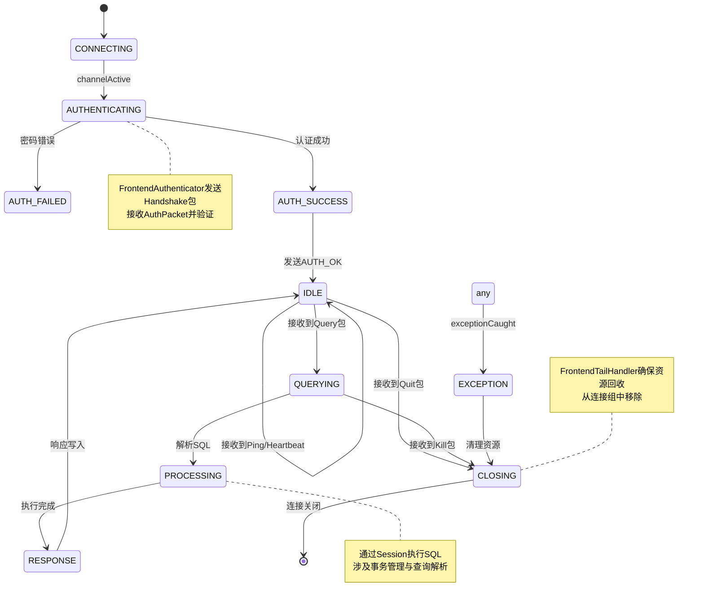

# 连接管理

<cite>
**本文档引用文件**  
- [FrontendConnection.java](file://src/main/java/alchemystar/freedom/engine/net/handler/frontend/FrontendConnection.java)
- [FrontConnectionFactory.java](file://src/main/java/alchemystar/freedom/engine/net/handler/factory/FrontConnectionFactory.java)
- [MySqlPacketDecoder.java](file://src/main/java/alchemystar/freedom/engine/net/codec/MySqlPacketDecoder.java)
- [FrontendTailHandler.java](file://src/main/java/alchemystar/freedom/engine/net/handler/frontend/FrontendTailHandler.java)
- [FrontendAuthenticator.java](file://src/main/java/alchemystar/freedom/engine/net/handler/frontend/FrontendAuthenticator.java)
- [FrontHandlerFactory.java](file://src/main/java/alchemystar/freedom/engine/net/handler/factory/FrontHandlerFactory.java)
- [Session.java](file://src/main/java/alchemystar/freedom/engine/session/Session.java)
- [BinaryPacket.java](file://src/main/java/alchemystar/freedom/engine/net/proto/mysql/BinaryPacket.java)
</cite>

## 目录
1. [引言](#引言)
2. [核心连接类 FrontendConnection](#核心连接类-frontendconnection)
3. [连接工厂 FrontConnectionFactory](#连接工厂-frontendconnectionfactory)
4. [MySQL协议解码器 MySqlPacketDecoder](#mysql协议解码器-mysqlpacketdecoder)
5. [连接尾部处理器 FrontendTailHandler](#连接尾部处理器-frontendentailhandler)
6. [连接状态机与生命周期](#连接状态机与生命周期)
7. [高并发场景下的连接管理与调优](#高并发场景下的连接管理与调优)

## 引言
本文档详细描述了Freedom数据库系统中连接管理模块的设计与实现。重点分析`FrontendConnection`作为客户端连接抽象的核心作用，涵盖其状态管理、上下文维护、会话属性存储及资源释放机制。同时解析`FrontConnectionFactory`如何通过工厂模式统一创建和初始化连接实例，`MySqlPacketDecoder`在Netty Pipeline中如何实现MySQL协议的分帧处理，以及`FrontendTailHandler`在连接异常和关闭时的清理逻辑。通过状态机图示与高并发调优建议，全面呈现连接模块的完整生命周期与性能优化路径。

## 核心连接类 FrontendConnection

`FrontendConnection`是客户端连接的核心抽象类，封装了与客户端通信所需的所有状态与行为。该类不仅维护了连接的基本信息（如用户、主机、端口、Schema、字符集等），还负责会话管理、事务控制、查询处理及响应写入。

### 状态与上下文管理
`FrontendConnection`通过`ChannelHandlerContext`与Netty通道绑定，确保所有I/O操作均在正确的网络上下文中执行。连接的活跃时间通过`lastActiveTime`字段记录，用于空闲检测与超时管理。连接ID由工厂类统一生成，保证全局唯一性。

### 会话与事务支持
每个`FrontendConnection`关联一个`Session`实例，由`SessionFactory`创建。`Session`封装了事务状态（`Trx`）、自动提交标志（`autocommit`）及SQL执行器（`SqlExecutor`）。事务操作（`begin`、`commit`、`rollback`）通过委托给`Session`完成，并通过`OkResponse.response(this)`向客户端返回确认。

### 查询与响应处理
连接通过`queryHandler`（默认为`ServerQueryHandler`）处理客户端发送的查询请求。`query`方法解析`BinaryPacket`中的SQL语句，并调用`execute`方法在`Session`上下文中执行。响应通过`writeOk()`、`writeErrMessage()`等方法封装为MySQL协议包并写入通道。

### 资源释放机制
`close()`方法用于主动关闭连接，通过`ctx.close()`触发Netty通道关闭流程，最终由Netty释放底层资源。

**Section sources**
- [FrontendConnection.java](file://src/main/java/alchemystar/freedom/engine/net/handler/frontend/FrontendConnection.java#L1-L320)
- [Session.java](file://src/main/java/alchemystar/freedom/engine/session/Session.java#L1-L51)

## 连接工厂 FrontConnectionFactory

`FrontConnectionFactory`采用工厂模式统一创建和初始化`FrontendConnection`实例，确保连接创建过程的一致性与可扩展性。

### 连接实例创建
`getConnection()`方法创建新的`FrontendConnection`实例，并完成以下初始化：
- 设置唯一连接ID（基于`AtomicInteger`递增）
- 绑定`ServerQueryHandler`作为默认查询处理器
- 设置默认字符集与事务隔离级别（从`SystemConfig`读取）
- 初始化最后活跃时间
- 创建并绑定新的`Session`实例

此模式实现了连接生命周期的集中控制，便于后续扩展连接池或连接监控功能。

**Section sources**
- [FrontConnectionFactory.java](file://src/main/java/alchemystar/freedom/engine/net/handler/factory/FrontConnectionFactory.java#L1-L38)
- [FrontendConnection.java](file://src/main/java/alchemystar/freedom/engine/net/handler/frontend/FrontendConnection.java#L25-L45)

## MySQL协议解码器 MySqlPacketDecoder

`MySqlPacketDecoder`是Netty Pipeline中的关键组件，负责将TCP字节流正确分帧为MySQL协议数据包，解决TCP粘包与拆包问题。

### 分帧机制
MySQL协议采用3字节长度头 + 1字节序列ID的结构。`MySqlPacketDecoder`通过以下步骤实现分帧：
1. 检查可读字节数是否至少为4（包头大小）
2. 读取3字节无符号整数作为包体长度（`packetLength`）
3. 读取1字节序列ID（`packetId`）
4. 检查剩余可读字节数是否满足`packetLength`
5. 若不满足，回溯读取索引并等待更多数据（半包处理）
6. 若满足，读取完整包体并封装为`BinaryPacket`对象，加入输出列表

### 过载保护
通过`maxPacketSize`（16MB）限制单个数据包的最大长度，防止恶意客户端发送超大包导致内存溢出。

**Section sources**
- [MySqlPacketDecoder.java](file://src/main/java/alchemystar/freedom/engine/net/codec/MySqlPacketDecoder.java#L1-L63)
- [BinaryPacket.java](file://src/main/java/alchemystar/freedom/engine/net/proto/mysql/BinaryPacket.java#L1-L42)

## 连接尾部处理器 FrontendTailHandler

`FrontendTailHandler`位于Netty Pipeline的末端，负责异常捕获与连接清理，是连接稳定性的最后一道防线。

### 异常处理
`exceptionCaught`方法捕获Pipeline中任何未处理的异常：
- 记录错误日志
- 将当前连接从`FrontendGroupHandler.frontendGroup`中移除，防止内存泄漏
- 向客户端发送错误响应（`ERR_EXCEPTION_CAUGHT`）

此机制确保即使在严重错误情况下，系统也能优雅地通知客户端并清理连接资源。

**Section sources**
- [FrontendTailHandler.java](file://src/main/java/alchemystar/freedom/engine/net/handler/frontend/FrontendTailHandler.java#L1-L32)
- [FrontendConnection.java](file://src/main/java/alchemystar/freedom/engine/net/handler/frontend/FrontendConnection.java#L270-L285)

## 连接状态机与生命周期

**Diagram sources**
- [FrontendAuthenticator.java](file://src/main/java/alchemystar/freedom/engine/net/handler/frontend/FrontendAuthenticator.java#L1-L173)
- [FrontendTailHandler.java](file://src/main/java/alchemystar/freedom/engine/net/handler/frontend/FrontendTailHandler.java#L1-L32)
- [FrontendConnection.java](file://src/main/java/alchemystar/freedom/engine/net/handler/frontend/FrontendConnection.java#L1-L320)

## 高并发场景下的连接管理与调优

在高并发场景下，连接管理模块需关注以下方面以确保系统稳定与高性能：

### 连接池优化
虽然当前实现未显式使用连接池，但`FrontConnectionFactory`的设计为引入连接池提供了良好基础。可通过复用`FrontendConnection`实例、预初始化`Session`等方式减少对象创建开销。

### 线程模型调优
Netty的EventLoop线程模型天然适合高并发。确保`FrontendConnection`的I/O操作（如`writeAndFlush`）在EventLoop线程中执行，避免跨线程同步开销。对于耗时的SQL执行，可考虑将`SqlExecutor.execute`提交到业务线程池，但需注意事务上下文传递。

### 内存与GC优化
- 控制`maxPacketSize`防止大包导致内存压力
- 使用`ByteBuf`池化减少GC压力
- 定期清理`frontendGroup`中已关闭的连接，防止内存泄漏

### 超时与空闲检测
通过`IdleStateHandler`配置合理的读写空闲超时（`IDLE_CHECK_INTERVAL`），及时关闭长时间无活动的连接，释放资源。

### 压力测试建议
1. 使用`sysbench`或`mysqlslap`模拟高并发连接与查询
2. 监控`FrontendConnection`实例数量、GC频率、CPU使用率
3. 逐步增加并发数，观察QPS、延迟及错误率变化
4. 调整`IDLE_CHECK_INTERVAL`、`maxPacketSize`等参数，寻找性能最优配置

**Section sources**
- [FrontHandlerFactory.java](file://src/main/java/alchemystar/freedom/engine/net/handler/factory/FrontHandlerFactory.java#L1-L41)
- [SystemConfig.java](file://src/main/java/alchemystar/freedom/config/SystemConfig.java)