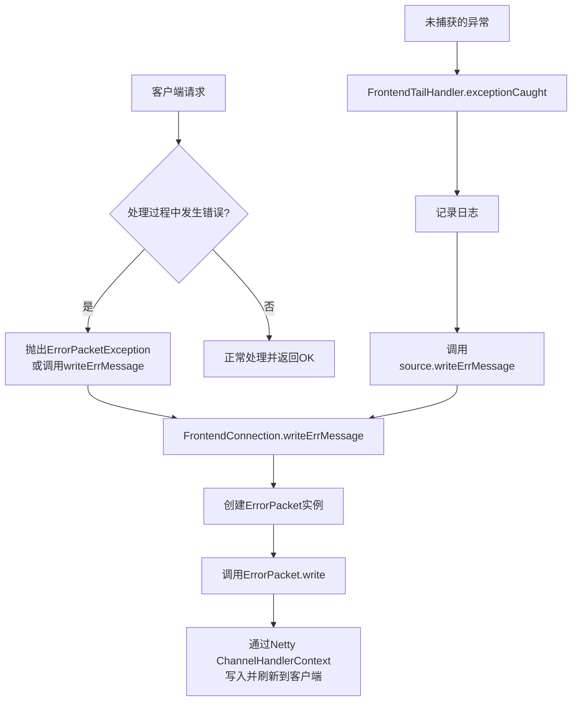
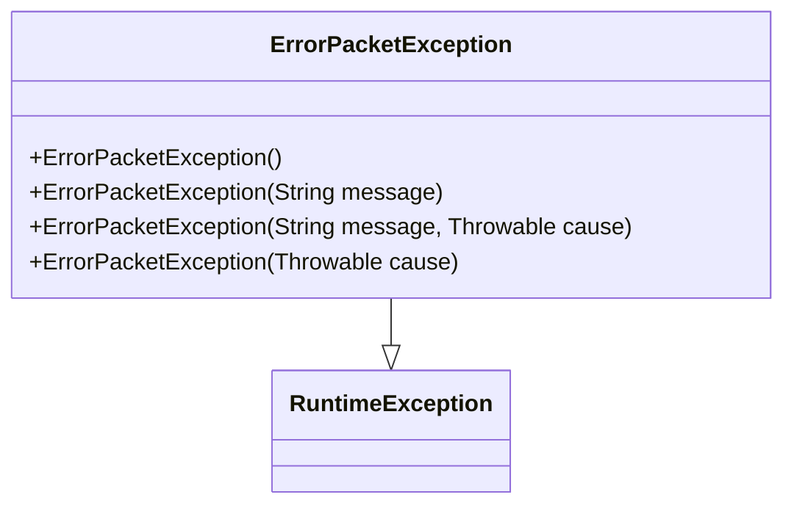
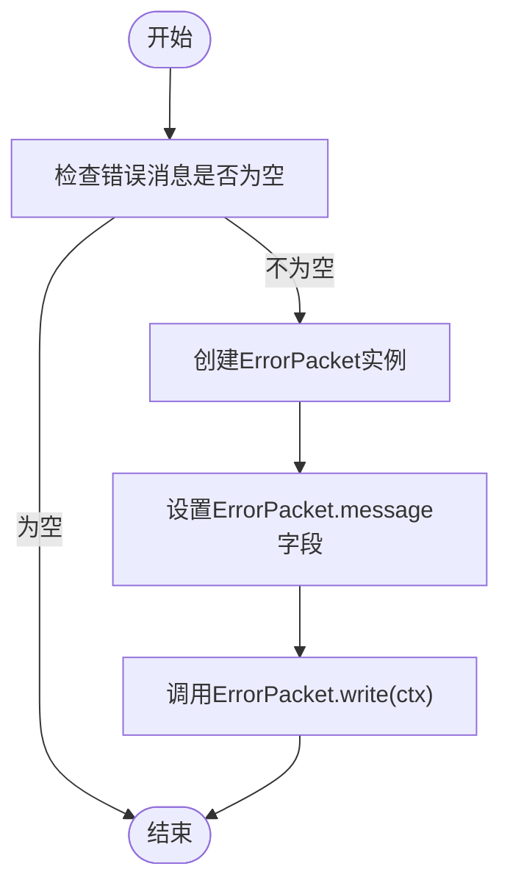
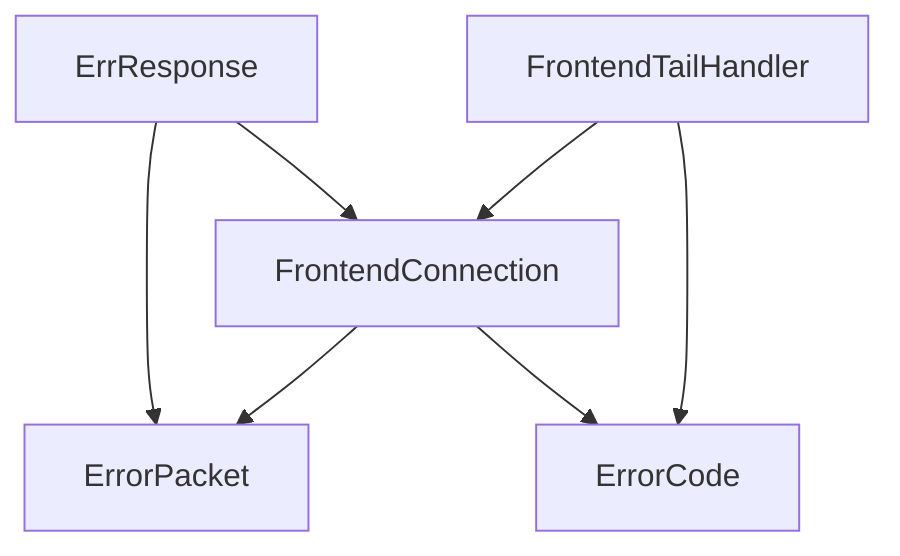

# 错误处理

<cite>
**本文档中引用的文件**   
- [ErrorPacketException.java](file://src/main/java/alchemystar/freedom/engine/net/exception/ErrorPacketException.java)
- [ErrorCode.java](file://src/main/java/alchemystar/freedom/engine/net/proto/util/ErrorCode.java)
- [ErrResponse.java](file://src/main/java/alchemystar/freedom/engine/net/response/ErrResponse.java)
- [FrontendConnection.java](file://src/main/java/alchemystar/freedom/engine/net/handler/frontend/FrontendConnection.java)
- [ErrorPacket.java](file://src/main/java/alchemystar/freedom/engine/net/proto/mysql/ErrorPacket.java)
- [FrontendTailHandler.java](file://src/main/java/alchemystar/freedom/engine/net/handler/frontend/FrontendTailHandler.java)
</cite>

## 目录
1. [引言](#引言)
2. [核心组件](#核心组件)
3. [架构概述](#架构概述)
4. [详细组件分析](#详细组件分析)
5. [依赖分析](#依赖分析)
6. [性能考虑](#性能考虑)
7. [故障排除指南](#故障排除指南)
8. [结论](#结论)

## 引言
本文档旨在全面阐述Freedom数据库系统中网络层错误处理机制的设计与实现。重点介绍`ErrorPacketException`异常类的设计目的及其在协议层的传播机制，详细说明`ErrorCode`常量类中定义的标准MySQL错误码（如`ER_PARSE_ERROR`、`ER_NO_DB_ERROR`）及其业务含义。同时，描述`ErrResponse`组件如何将内部异常转换为标准的`ErrorPacket`并通过Netty Channel写回客户端，确保错误信息的格式兼容性和可读性。此外，分析典型错误场景的处理流程，并讨论异常堆栈的记录策略与日志级别控制。

## 核心组件
本系统的核心错误处理组件包括`ErrorPacketException`、`ErrorCode`、`ErrResponse`和`ErrorPacket`。这些组件协同工作，构建了一个健壮且标准化的错误处理流程。`ErrorPacketException`作为自定义运行时异常，用于封装网络协议层的错误信息。`ErrorCode`接口定义了所有标准的MySQL错误码，为错误分类和识别提供了统一的依据。`ErrResponse`是错误响应的生成器，负责将错误信息封装成网络协议包。最终，`ErrorPacket`类实现了MySQL协议中错误包的具体格式，确保与客户端的兼容性。

**本节来源**
- [ErrorPacketException.java](file://src/main/java/alchemystar/freedom/engine/net/exception/ErrorPacketException.java)
- [ErrorCode.java](file://src/main/java/alchemystar/freedom/engine/net/proto/util/ErrorCode.java)
- [ErrResponse.java](file://src/main/java/alchemystar/freedom/engine/net/response/ErrResponse.java)
- [ErrorPacket.java](file://src/main/java/alchemystar/freedom/engine/net/proto/mysql/ErrorPacket.java)

## 架构概述
系统的错误处理架构遵循分层设计原则，从异常的产生、捕获到最终的响应生成和发送，形成了一个清晰的调用链。当系统在处理客户端请求时发生错误，会抛出`ErrorPacketException`或直接调用`FrontendConnection`的`writeErrMessage`方法。该方法接收错误码和消息，创建一个`ErrorPacket`实例，并通过Netty的`ChannelHandlerContext`将其写入网络通道。`FrontendTailHandler`作为Netty管道中的最后一个处理器，负责捕获任何未被处理的异常，并将其转换为标准的错误响应发送给客户端，从而保证了系统的稳定性和客户端体验。

**图示来源**
- [FrontendConnection.java](file://src/main/java/alchemystar/freedom/engine/net/handler/frontend/FrontendConnection.java#L200-L250)
- [ErrorPacket.java](file://src/main/java/alchemystar/freedom/engine/net/proto/mysql/ErrorPacket.java#L50-L70)
- [FrontendTailHandler.java](file://src/main/java/alchemystar/freedom/engine/net/handler/frontend/FrontendTailHandler.java#L25-L30)

## 详细组件分析

### ErrorPacketException 异常类分析
`ErrorPacketException`是系统网络层的核心异常类，继承自`RuntimeException`。它的设计目的是为了在协议处理层明确地表示一个需要通过MySQL错误包返回给客户端的错误。该类提供了多个构造函数，允许在创建异常时指定错误消息、根本原因（`Throwable`）或两者。这种设计使得开发者可以在捕获底层异常后，包装成一个更具业务意义的`ErrorPacketException`，从而在错误传播过程中保留原始的堆栈信息，便于后续的调试和问题定位。

**图示来源**
- [ErrorPacketException.java](file://src/main/java/alchemystar/freedom/engine/net/exception/ErrorPacketException.java#L1-L25)

### ErrorCode 常量类分析
`ErrorCode`是一个接口，其中定义了所有可能的错误码常量。这些常量分为两部分：一部分是系统内部使用的错误码（如`ERR_OPEN_SOCKET`），另一部分是与MySQL协议完全兼容的标准错误码（如`ER_PARSE_ERROR`）。通过使用这些预定义的常量，系统确保了错误码的唯一性和可读性。例如，`ER_PARSE_ERROR`（值为1064）表示SQL语法解析错误，而`ER_NO_DB_ERROR`（值为1046）表示未选择数据库。这种设计不仅便于客户端根据错误码进行精确的错误处理，也方便了开发人员在日志中快速识别问题。

**本节来源**
- [ErrorCode.java](file://src/main/java/alchemystar/freedom/engine/net/proto/util/ErrorCode.java#L1-L522)

### ErrResponse 组件分析
`ErrResponse`是一个工具类，提供了一个静态方法`response`来简化错误响应的发送。该方法接收一个`FrontendConnection`实例和一个错误消息字符串。它首先检查消息是否为空，然后创建一个`ErrorPacket`对象，将消息字符串转换为字节数组并赋值给`ErrorPacket`的`message`字段，最后调用`ErrorPacket`的`write`方法将错误包发送出去。这个组件的作用是将错误处理的逻辑从具体的业务处理器中解耦出来，提供了一个统一的错误响应入口。

**图示来源**
- [ErrResponse.java](file://src/main/java/alchemystar/freedom/engine/net/response/ErrResponse.java#L1-L21)

## 依赖分析
错误处理模块的组件之间存在紧密的依赖关系。`ErrResponse`直接依赖于`ErrorPacket`来构建网络包，并依赖于`FrontendConnection`来获取Netty的上下文（`ChannelHandlerContext`）。`FrontendConnection`是整个错误处理流程的核心枢纽，它既依赖于`ErrorPacket`来发送错误，也依赖于`ErrorCode`来获取标准的错误码。`FrontendTailHandler`作为异常的最终捕获者，依赖于`FrontendConnection`来发送错误响应。这种依赖结构确保了错误信息能够从系统的任何角落，通过一个标准化的路径，最终传递给客户端。

**图示来源**
- [ErrResponse.java](file://src/main/java/alchemystar/freedom/engine/net/response/ErrResponse.java)
- [FrontendConnection.java](file://src/main/java/alchemystar/freedom/engine/net/handler/frontend/FrontendConnection.java)
- [FrontendTailHandler.java](file://src/main/java/alchemystar/freedom/engine/net/handler/frontend/FrontendTailHandler.java)

## 性能考虑
系统的错误处理机制在设计上充分考虑了性能影响。首先，`ErrorPacket`的`write`方法直接使用Netty的`ByteBuf`进行缓冲区操作，避免了不必要的对象创建和内存拷贝，保证了网络I/O的高效性。其次，错误码以静态常量的形式存在，访问速度极快。对于异常的处理，系统采用了“快速失败”原则，一旦检测到错误（如空SQL、未知字符集），立即构造错误响应并返回，避免了后续不必要的计算资源消耗。此外，`FrontendTailHandler`中的日志记录使用了`ERROR`级别，确保了关键错误信息的留存，同时避免了在正常流程中产生过多的日志开销。

## 故障排除指南
当客户端收到错误响应时，应首先检查返回的错误码（`errno`）。根据`ErrorCode`接口中的定义，可以快速定位错误类型。例如：
- **SQL语法错误**: 错误码为`ER_PARSE_ERROR` (1064)，错误消息通常包含具体的语法问题。
- **未选择数据库**: 错误码为`ER_NO_DB_ERROR` (1046)，客户端需要先执行`USE database_name`命令。
- **权限不足**: 错误码为`ER_ACCESS_DENIED_ERROR` (1045)，需检查用户名和密码是否正确。
- **未知数据库**: 错误码为`ER_BAD_DB_ERROR` (1049)，表示指定的数据库不存在。

在服务器端，应检查日志文件。`FrontendTailHandler`会记录所有未捕获异常的完整堆栈信息，这对于诊断深层次的系统问题至关重要。如果发现大量`ERR_EXCEPTION_CAUGHT`错误，说明系统内部可能存在未被妥善处理的异常，需要进一步排查相关业务逻辑。

**本节来源**
- [ErrorCode.java](file://src/main/java/alchemystar/freedom/engine/net/proto/util/ErrorCode.java)
- [FrontendTailHandler.java](file://src/main/java/alchemystar/freedom/engine/net/handler/frontend/FrontendTailHandler.java#L25-L30)

## 结论
Freedom数据库系统的错误处理机制设计精良，通过`ErrorPacketException`、`ErrorCode`、`ErrResponse`和`ErrorPacket`等组件的协同工作，实现了一个标准化、高效且易于维护的错误处理流程。该机制严格遵循MySQL协议规范，确保了与各种客户端工具的兼容性。同时，通过`FrontendTailHandler`的兜底处理，保证了服务的健壮性。未来可以考虑在`ErrorCode`中增加更详细的错误分类，并在`ErrResponse`中支持SQLSTATE的设置，以提供更丰富的错误信息。