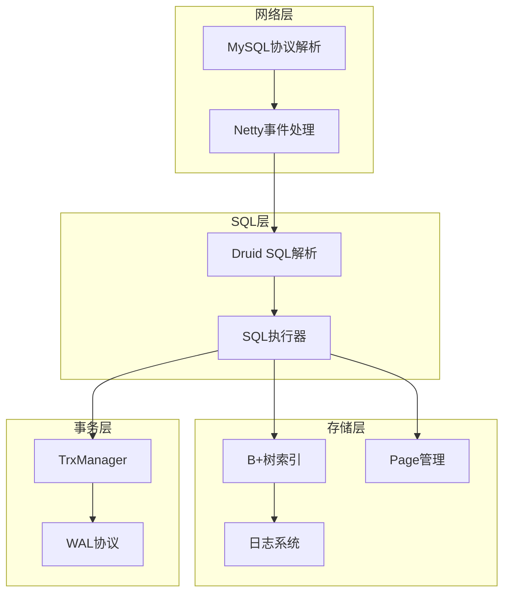

# 项目概述

<cite>
**本文档引用文件**  
- [README.md](file://README.md)
- [FreedomServer.java](file://src/main/java/alchemystar/freedom/engine/server/FreedomServer.java)
- [Database.java](file://src/main/java/alchemystar/freedom/Database.java)
- [BPTree.java](file://src/main/java/alchemystar/freedom/index/bp/BPTree.java)
- [SelectExecutor.java](file://src/main/java/alchemystar/freedom/sql/SelectExecutor.java)
- [TableManager.java](file://src/main/java/alchemystar/freedom/meta/TableManager.java)
- [PagePool.java](file://src/main/java/alchemystar/freedom/store/page/PagePool.java)
- [TrxManager.java](file://src/main/java/alchemystar/freedom/transaction/TrxManager.java)
- [Cursor.java](file://src/main/java/alchemystar/freedom/access/Cursor.java)
- [HandshakePacket.java](file://src/main/java/alchemystar/freedom/engine/net/proto/mysql/HandshakePacket.java)
</cite>

## 目录
1. [项目简介](#项目简介)
2. [设计哲学与核心定位](#设计哲学与核心定位)
3. [主要应用场景](#主要应用场景)
4. [技术愿景与功能边界](#技术愿景与功能边界)
5. [系统架构与模块协同](#系统架构与模块协同)
6. [学习路径指引](#学习路径指引)

## 项目简介

Freedom项目是一个轻量级的MySQL协议兼容数据库系统，旨在通过从零实现数据库核心组件来深入理解数据库底层原理。该项目覆盖了从网络协议交互到文件存储的完整链条，包括SQL解析、执行引擎、B+树索引、事务日志（WAL）、元数据管理等关键模块。项目采用Druid SQL Parser进行SQL解析，并实现了MySQL客户端协议，支持通过标准MySQL客户端或JDBC连接访问。

项目名称“Freedom”寓意对数据库内部机制的自由探索与掌控。其主要目标并非替代成熟的商业数据库，而是作为一个教学工具和原理验证平台，帮助开发者理解数据库系统的内部工作机制。

**Section sources**
- [README.md](file://README.md#L1-L133)
- [FreedomServer.java](file://src/main/java/alchemystar/freedom/engine/server/FreedomServer.java#L21-L75)

## 设计哲学与核心定位

Freedom的设计哲学强调简洁性与可理解性，遵循“造轮子”的理念，通过亲手实现数据库的各个组件来验证理论知识。其核心定位是成为一个教育型数据库系统，专注于展示数据库的核心原理而非追求高性能或高并发。

项目采用索引组织表（Index Organized Table）结构，所有数据均通过B+树索引进行组织和访问。存储层以Page为单位与磁盘交互，通过PagePool实现内存页的复用与管理。事务处理采用WAL（Write-Ahead Logging）协议，记录redo/undo日志以保证原子性和崩溃恢复能力。

网络层基于Netty框架实现，采用MySQL协议进行客户端通信，支持握手、认证、查询等基本操作。SQL解析委托给成熟的Druid库，将SQL语句转换为内部操作符树，进而执行相应的语义操作。

**Section sources**
- [README.md](file://README.md#L15-L45)
- [PagePool.java](file://src/main/java/alchemystar/freedom/store/page/PagePool.java#L0-L52)
- [TrxManager.java](file://src/main/java/alchemystar/freedom/transaction/TrxManager.java#L0-L22)

## 主要应用场景

### 数据库教学
Freedom是理想的数据库教学工具，其代码结构清晰，模块划分明确，适合用于讲解数据库系统的各个组成部分。学生可以通过阅读源码理解B+树的实现、事务日志的工作机制、SQL执行流程等核心概念。

### 嵌入式场景
由于其轻量级特性，Freedom可作为嵌入式数据库使用，适用于资源受限的环境或需要定制化存储引擎的场景。其简单的架构使其易于集成到其他Java应用中。

### 原理验证
开发者可以基于Freedom验证数据库领域的各种算法和数据结构，如B+树变种、查询优化策略、并发控制机制等。项目提供了完整的执行环境，便于进行实验和测试。

**Section sources**
- [README.md](file://README.md#L134-L150)

## 技术愿景与功能边界

### 技术愿景
Freedom的技术愿景是构建一个完整但简洁的数据库原型，涵盖数据库系统的核心功能。项目希望通过实践加深对数据库设计原则的理解，特别是“控制复杂度”的重要性。作者在开发过程中深刻体会到，保持接口简洁和设计优雅是实现大型系统的必要条件。

### 当前功能边界
当前版本的Freedom已实现以下核心功能：
- MySQL协议兼容的网络通信
- 基于B+树的存储引擎
- 支持SELECT、INSERT、DELETE、UPDATE等基本SQL操作
- 事务的原子性保证（通过WAL）
- 元数据的持久化存储

然而，项目仍存在明显功能缺失：
- 缺乏并发控制机制（如锁系统）
- 未实现MVCC（多版本并发控制）
- 无检查点（Checkpoint）机制
- 不支持分布式部署

与成熟数据库（如MySQL）相比，Freedom在性能、可靠性、功能完整性方面仍有巨大差距，但其价值在于教学和原理验证而非生产使用。

**Section sources**
- [README.md](file://README.md#L151-L180)
- [BPTree.java](file://src/main/java/alchemystar/freedom/index/bp/BPTree.java#L0-L277)

## 系统架构与模块协同

Freedom的系统架构可分为以下几个核心模块：

**Diagram sources**
- [HandshakePacket.java](file://src/main/java/alchemystar/freedom/engine/net/proto/mysql/HandshakePacket.java#L0-L77)
- [SelectExecutor.java](file://src/main/java/alchemystar/freedom/sql/SelectExecutor.java#L0-L122)
- [BPTree.java](file://src/main/java/alchemystar/freedom/index/bp/BPTree.java#L0-L277)

各模块协同工作流程如下：
1. 网络层接收MySQL协议包，通过FrontHandlerFactory分发处理
2. SQL解析模块将SQL语句转换为操作符树
3. 执行引擎根据操作语义调用相应模块
4. 存储引擎通过B+树进行数据的读写操作
5. 事务管理器记录redo/undo日志确保原子性
6. PagePool管理内存页的分配与回收

以SELECT查询为例，流程涉及SelectExecutor、TableFilter、Cursor等多个组件的协作，最终通过B+树游标遍历符合条件的数据行。

**Section sources**
- [README.md](file://README.md#L46-L133)
- [SelectExecutor.java](file://src/main/java/alchemystar/freedom/sql/SelectExecutor.java#L0-L122)
- [TableManager.java](file://src/main/java/alchemystar/freedom/meta/TableManager.java#L0-L71)
- [Cursor.java](file://src/main/java/alchemystar/freedom/access/Cursor.java#L0-L15)

## 学习路径指引

### 初学者路径
1. 阅读README了解项目整体架构
2. 运行FreedomServer启动数据库实例
3. 通过MySQL客户端连接并执行简单SQL
4. 跟踪SQL执行流程，从网络层到存储层
5. 研究B+树的实现细节（BPTree类）
6. 理解事务日志的工作机制

### 高级用户路径
1. 分析PagePool的内存管理策略
2. 研究索引组织表的实现原理
3. 探索查询优化器的潜在改进空间
4. 实验性添加锁机制或MVCC支持
5. 扩展SQL语法支持或性能监控功能

通过循序渐进的学习，用户可以从宏观到微观全面掌握数据库系统的设计与实现。

**Section sources**
- [README.md](file://README.md#L181-L210)
- [FreedomServer.java](file://src/main/java/alchemystar/freedom/engine/server/FreedomServer.java#L21-L75)